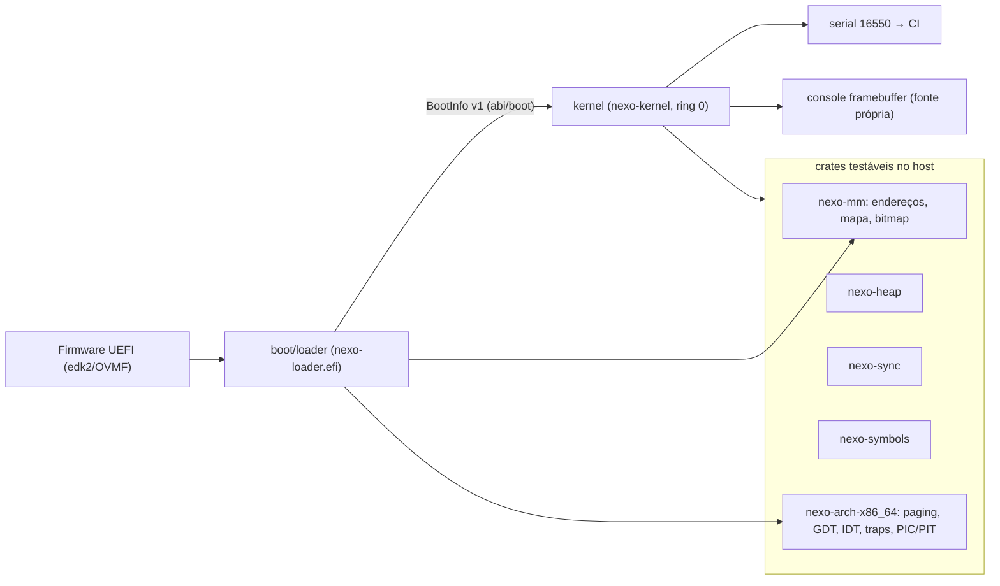

# Arquitetura vigente — Nexo OS (`0.0.1-boot` + Fase 1 em `main`)

Este documento descreve **o que existe** hoje. A arquitetura-alvo está no Plano Mestre §3 e nas ADRs (`docs/adr/`).

## Visão geral

## Componentes

| Diretório | Crate | Alvo | Papel |
|---|---|---|---|
| `abi/boot` | `nexo-boot-abi` | qualquer | Contrato loader→kernel (`BootInfo`, `MemoryRegion`, constantes de layout). `deny(unsafe_code)`. |
| `arch/x86_64` | `nexo-arch-x86_64` | host (estruturas) / x86_64 (asm) | Paginação de 4 níveis (`Mapper`), GDT/TSS, IDT, stubs de trap (256), troca de contexto, CRs/MSRs/GS, UART 16550, PIC 8259, PIT, LAPIC (xAPIC), I/O APIC, trampolim de AP (INIT/SIPI), `isa-debug-exit`. |
| `kernel/lib/mm` | `nexo-mm` | qualquer | `PhysAddr/VirtAddr`, normalização do mapa de memória, `BitmapFrameAllocator` (dois bitmaps: ocupado/utilizável). |
| `kernel/lib/heap` | `nexo-heap` | qualquer | Lista de blocos livres, first-fit, coalescência, cabeçalho por alocação, estatísticas. |
| `kernel/lib/sync` | `nexo-sync` | qualquer | `SpinLock`, `Once`. |
| `kernel/lib/symbols` | `nexo-symbols` | qualquer | Leitura de `.symtab` ELF64 e demangling (legado e v0). |
| `kernel/lib/acpi` | `nexo-acpi` | qualquer | RSDP/XSDT/RSDT, MADT (CPUs, LAPIC, I/O APIC, overrides), HPET; sem alocação. |
| `libraries/font` | `nexo-font` | qualquer | Fonte 8×8 própria (texto → bits em `const fn`). |
| `boot/loader` | `nexo-loader` | `x86_64-unknown-uefi` | Lê `\nexo\kernel.elf` e `\nexo\boot.cfg`, GOP, RSDP, constrói tabelas (physmap 2 MiB NX, kernel W^X, pilha + guard page), copia o ELF para símbolos, `ExitBootServices`, converte o mapa, habilita NXE e salta. |
| `kernel` | `nexo-kernel` | `x86_64-unknown-none` | Ver abaixo. |
| `tools/` | Python | host | `build-image`, `run-qemu`, `test-qemu`, `symbolize`, `check-toolchain`, `mkgpt.py`. |

## Kernel — sequência de boot

1. `_start(&BootInfo)` (RDI, pilha em `KERNEL_STACK_TOP`, CR3 do loader).
2. `klog::init` — serial COM1, formato `[s.us] NIVEL modulo: msg`.
3. `boot::init` — valida `BootInfo`, aplica `loglevel=`, detecta modo de teste.
4. `x86::gdt::init` — GDT (código 0x08, dados 0x10, TSS 0x18) e IST1 (16 KiB) para `#DF`.
5. `x86::traps::init` — IDT com 256 stubs; handlers: `#BP` conta, `#PF` sonda/fatal, `#DF` diagnóstico de estouro, IRQ0 timer.
6. `symbols::init` — `.symtab` da cópia do ELF (entregue pelo loader).
7. `mm::phys::init` — mapa normalizado (reserva 1 MiB, framebuffer), bitmap na primeira região utilizável.
8. `mm::virt::init` — remove alias identidade (PML4[0]), liga CR0.WP, imprime permissões de `.text/.rodata/.data`.
9. `mm::heap::init` — 1 MiB em `KERNEL_HEAP_BASE`, cresce sob demanda até 64 MiB, guard pages.
10. `console::init` — framebuffer (se houver), espelha o log.
11. `acpi::init` — RSDP → MADT (CPUs, LAPIC, I/O APICs, overrides ISA), HPET.
12. `x86::percpu::init_bsp` — estrutura por CPU (`gs:[0]`), GDT/TSS/#DF próprias da BSP.
13. `x86::apic::init_bsp` — LAPIC mapeado sem cache, PIC remapeado e mascarado, I/O APICs mascarados.
14. `time::init` — calibra TSC e timer do LAPIC pelo PIT (canal 2, 20 ms); tick de 1000 Hz; TSC vira o relógio monotônico; `sti`.
15. `x86::smp::boot_aps` — trampolim em `0x8000`, pilhas por CPU, INIT/SIPI/SIPI; APs carregam GDT/TSS/IDT/LAPIC/timer e viram threads idle.
16. `sched::init` — thread `main` (contexto de boot) + idle da BSP; escalonador preemptivo ativo.
17. `selftest::run` — 25 testes com marcadores `[TEST]`/`[RESULT]`; cenários `test=panic|fault|overflow`; `stress=<s>`.
18. `exit` → `isa-debug-exit` (33 sucesso / 35 falha) ou a thread `main` dorme em laço com relatório periódico.

## Interrupções e tempo

| Vetor | Uso |
|---|---|
| 0x00–0x1f | exceções (stubs em asm; `#PF` com sondas de falta esperada; `#DF` em IST1) |
| 0x20 | timer do LAPIC (por CPU): contador por CPU, tick global só na BSP, `sched::on_tick` |
| 0x21 | entrada de teste do I/O APIC (PIT via GSI, só no auto-teste) |
| 0x30–0x3f | PIC legado (mascarado; qualquer chegada é espúria) |
| 0xf0 | IPI RESCHED (`sched::on_resched_ipi`) |
| 0xf1 | IPI HALT (panic/exceção fatal param as outras CPUs) |
| 0xf2 | IPI TLB_FLUSH (shootdown após unmap/update de página) |
| 0xfe / 0xff | erro do LAPIC / espúria |

Relógio: TSC calibrado (≈1 GHz no QEMU) → `monotonic_ns`; ticks (1000 Hz) apenas para quantum e despertar de sleepers. Em TCG as expirações coalescem durante `hlt`, por isso o tick não é fonte de tempo.

## SMP e escalonador

- Dados por CPU (`PerCpu`, `gs:[0]`): índice, APIC ID, GDT/TSS/pilha de `#DF` próprias, contadores, thread atual e idle.
- APs: pilhas de 64 KiB em slots de 128 KiB (guarda) a partir de `0xffff_ffff_a000_0000`.
- Threads (`sched.rs`): fila global FIFO sob spinlock (IRQs off), quantum de 10 ticks, preempção dentro do handler do timer, `spawn/yield/sleep/join/exit/reap`, thread moribunda recolhida por quem recebe a CPU (`finish_switch`), pilhas de 32 KiB em slots de 64 KiB (guarda) a partir de `0xffff_ffff_b000_0000`, IPI RESCHED para CPU ociosa.
- Regra de locks: todo spinlock do kernel é detido com interrupções desabilitadas (`IrqLock`/`without_interrupts`), senão a preempção poderia escalonar na mesma CPU uma thread que gira pelo mesmo lock.
- Limitações registradas: shootdown de TLB sem confirmação (fire-and-forget); sem prioridades/afinidade; TSC assumido sincronizado entre CPUs (QEMU).

## Layout de memória virtual (x86_64)

| Região | Endereço | Notas |
|---|---|---|
| physmap | `0xffff_8000_0000_0000` + fís. | 2 MiB, RW, NX; cobre RAM + framebuffer + ≥ 4 GiB |
| pilha inicial | `0xffff_ffff_7fe0_0000`..`+64 KiB` | guard page abaixo (não mapeada) |
| kernel | `0xffff_ffff_8000_0000` | `.text` RX, `.rodata` R, `.data/.bss` RW (PHDRS explícitos) |
| pilhas das APs | `0xffff_ffff_a000_0000` | slots de 128 KiB, 64 KiB mapeados |
| pilhas de threads | `0xffff_ffff_b000_0000` | slots de 64 KiB, 32 KiB mapeados |
| heap | `0xffff_ffff_c000_0000` | guard pages nas bordas, cresce por páginas |
| área de teste | `0xffff_ffff_d000_0000` | auto-testes e stress (`d100_0000+`) |
| MMIO | `0xffff_ffff_e000_0000` | LAPIC (`e000_0000`), I/O APICs (`e010_0000+`), sem cache |
| trampolim SMP | `0x8000` (identidade, temporário) | só durante `boot_aps`; PML4[0] fica com tabelas vazias |

## Componentes privilegiados (ADR-0002)

Tudo é ring 0 — não há ainda espaço de usuário. Itens temporários a remover/isolar: PIT (só calibração e teste do I/O APIC), UART no kernel (→ serviço de log/console, Fase 2), console de framebuffer (→ compositor, Fase 5).

## Invariantes verificados por teste

W^X das seções, NX no heap/pilha/physmap, guard pages de pilha e heap, CR0.WP, recuperação de `#PF` por sonda, isolamento de quadros (sem duplicatas, frame 0 e < 1 MiB nunca alocados), coalescência do heap sem vazamento, timer monotônico, intercalação determinística `ABABAB` das tarefas, symbolication de `kmain`.
