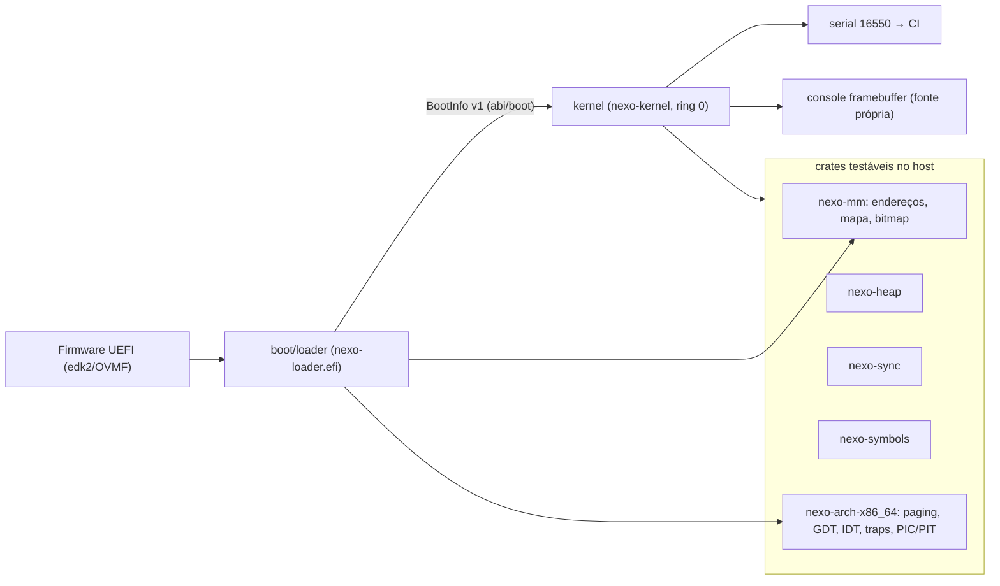

# Arquitetura vigente — Nexo OS `0.0.1-boot`

Este documento descreve **o que existe** hoje. A arquitetura-alvo está no Plano Mestre §3 e nas ADRs (`docs/adr/`).

## Visão geral

## Componentes

| Diretório | Crate | Alvo | Papel |
|---|---|---|---|
| `abi/boot` | `nexo-boot-abi` | qualquer | Contrato loader→kernel (`BootInfo`, `MemoryRegion`, constantes de layout). `deny(unsafe_code)`. |
| `arch/x86_64` | `nexo-arch-x86_64` | host (estruturas) / x86_64 (asm) | Paginação de 4 níveis (`Mapper`), GDT/TSS, IDT, stubs de trap (256), troca de contexto, CRs/MSRs/portas, UART 16550, PIC 8259, PIT, `isa-debug-exit`. |
| `kernel/lib/mm` | `nexo-mm` | qualquer | `PhysAddr/VirtAddr`, normalização do mapa de memória, `BitmapFrameAllocator` (dois bitmaps: ocupado/utilizável). |
| `kernel/lib/heap` | `nexo-heap` | qualquer | Lista de blocos livres, first-fit, coalescência, cabeçalho por alocação, estatísticas. |
| `kernel/lib/sync` | `nexo-sync` | qualquer | `SpinLock`, `Once`. |
| `kernel/lib/symbols` | `nexo-symbols` | qualquer | Leitura de `.symtab` ELF64 e demangling legado. |
| `libraries/font` | `nexo-font` | qualquer | Fonte 8×8 própria (texto → bits em `const fn`). |
| `boot/loader` | `nexo-loader` | `x86_64-unknown-uefi` | Lê `\nexo\kernel.elf` e `\nexo\boot.cfg`, GOP, RSDP, constrói tabelas (physmap 2 MiB NX, kernel W^X, pilha + guard page), copia o ELF para símbolos, `ExitBootServices`, converte o mapa, habilita NXE e salta. |
| `kernel` | `nexo-kernel` | `x86_64-unknown-none` | Ver abaixo. |
| `tools/` | Python | host | `build-image`, `run-qemu`, `test-qemu`, `symbolize`, `check-toolchain`, `mkgpt.py`. |

## Kernel — sequência de boot

1. `_start(&BootInfo)` (RDI, pilha em `KERNEL_STACK_TOP`, CR3 do loader).
2. `klog::init` — serial COM1, formato `[s.us] NIVEL modulo: msg`.
3. `boot::init` — valida `BootInfo`, aplica `loglevel=`, detecta modo de teste.
4. `x86::gdt::init` — GDT (código 0x08, dados 0x10, TSS 0x18) e IST1 (16 KiB) para `#DF`.
5. `x86::traps::init` — IDT com 256 stubs; handlers: `#BP` conta, `#PF` sonda/fatal, `#DF` diagnóstico de estouro, IRQ0 timer.
6. `symbols::init` — `.symtab` da cópia do ELF (entregue pelo loader).
7. `mm::phys::init` — mapa normalizado (reserva 1 MiB, framebuffer), bitmap na primeira região utilizável.
8. `mm::virt::init` — remove alias identidade (PML4[0]), liga CR0.WP, imprime permissões de `.text/.rodata/.data`.
9. `mm::heap::init` — 1 MiB em `KERNEL_HEAP_BASE`, cresce sob demanda até 64 MiB, guard pages.
10. `console::init` — framebuffer (se houver), espelha o log.
11. `time::init` — PIC remapeado (0x20), PIT 1000 Hz, `sti`.
12. `task::init` — escalonador cooperativo (tarefa 0 = boot).
13. `selftest::run` — 15 testes com marcadores `[TEST]`/`[RESULT]`; cenários `test=panic|fault|overflow`.
14. `exit` → `isa-debug-exit` (33 sucesso / 35 falha) ou laço ocioso com `hlt`.

## Layout de memória virtual (x86_64)

| Região | Endereço | Notas |
|---|---|---|
| physmap | `0xffff_8000_0000_0000` + fís. | 2 MiB, RW, NX; cobre RAM + framebuffer + ≥ 4 GiB |
| pilha inicial | `0xffff_ffff_7fe0_0000`..`+64 KiB` | guard page abaixo (não mapeada) |
| kernel | `0xffff_ffff_8000_0000` | `.text` RX, `.rodata` R, `.data/.bss` RW (PHDRS explícitos) |
| heap | `0xffff_ffff_c000_0000` | guard pages nas bordas, cresce por páginas |
| área de teste | `0xffff_ffff_d000_0000` | usada apenas pelos auto-testes |

## Componentes privilegiados (ADR-0002)

Tudo nesta release é ring 0 — não há ainda espaço de usuário. Itens temporários a remover/isolar: PIC/PIT (→ APIC, Fase 1), UART no kernel (→ serviço de log/console, Fase 2), console de framebuffer (→ compositor, Fase 5).

## Invariantes verificados por teste

W^X das seções, NX no heap/pilha/physmap, guard pages de pilha e heap, CR0.WP, recuperação de `#PF` por sonda, isolamento de quadros (sem duplicatas, frame 0 e < 1 MiB nunca alocados), coalescência do heap sem vazamento, timer monotônico, intercalação determinística `ABABAB` das tarefas, symbolication de `kmain`.
