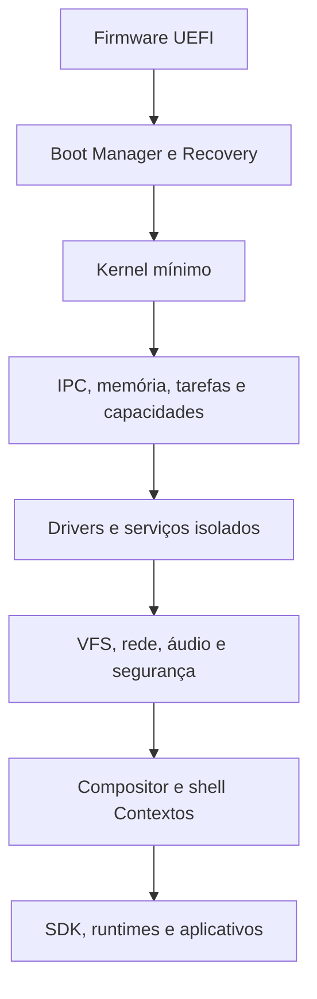

# Plano Mestre — Sistema Operacional Próprio de Alto Nível

**Documento:** roadmap técnico, estratégico e operacional  
**Versão:** 1.0  
**Data-base:** 28 de agosto de 2026  
**Horizonte:** 8 a 12+ anos para uma pessoa; menor com equipe experiente  
**Estado inicial:** planejamento → **Fase 0 concluída em 2026-08-29** (ver `docs/CHECKLIST_STATUS.md`)  
**Nome do projeto:** `Nexo OS` (provisório; era `[DEFINIR] OS`)

---

## 1. Objetivo do projeto

Construir do zero um sistema operacional de uso geral com kernel, serviços de sistema, drivers, armazenamento, rede, interface gráfica, plataforma de aplicativos, segurança, instalador e atualizações próprios. O padrão de qualidade desejado é o de um sistema desktop moderno, comparável a Windows 11, macOS e distribuições Linux maduras nos equipamentos oficialmente suportados.

“Comparável” não significa copiar a interface nem atingir imediatamente a mesma compatibilidade de hardware ou catálogo de programas. Windows, macOS e Linux acumulam décadas de trabalho, equipes grandes e colaboração de fabricantes. A meta realista é:

- possuir arquitetura própria e coerente;
- ser estável, seguro e visualmente refinado;
- funcionar muito bem em QEMU e em um pequeno conjunto de computadores de referência;
- oferecer aplicativos essenciais e um SDK utilizável;
- crescer gradualmente em compatibilidade, comunidade e hardware.

### 1.1 O que “do zero” significa neste plano

O sistema terá kernel, modelo de processos, IPC, userland, compositor, shell gráfico e serviços próprios. Ele não será uma distribuição Linux e não usará o kernel Linux como base.

Ainda será correto usar:

- compiladores, linguagens e depuradores existentes;
- especificações abertas como UEFI, ACPI, PCI, USB, TCP/IP, POSIX e VirtIO;
- QEMU para virtualização;
- bibliotecas pequenas e auditadas quando isso não elimina o aprendizado central;
- fontes, formatos de arquivo e protocolos padronizados;
- código externo somente após análise de licença, segurança e manutenção.

Criar também uma CPU, uma ISA e todo o hardware não faz parte do escopo. A “arquitetura própria” será a arquitetura de software, segurança, serviços e experiência do sistema. Uma porta para RISC-V poderá ser feita no futuro.

---

## 2. Visão de produto

### 2.1 Proposta central

Um sistema operacional rápido, compreensível e seguro por padrão, no qual aplicativos recebem apenas as capacidades explicitamente concedidas, serviços podem ser atualizados de forma modular e o usuário entende o que está acontecendo com seus dados, dispositivos e tarefas.

### 2.2 Princípios não negociáveis

1. **Segurança por construção:** privilégio mínimo, isolamento, atualizações assinadas e redução de código privilegiado.
2. **Memória segura:** Rust como linguagem principal; `unsafe` e Assembly concentrados, documentados e auditáveis.
3. **Compatibilidade planejada:** ABI versionada e camadas de compatibilidade; nenhuma promessa informal de estabilidade.
4. **Recuperação antes da conveniência:** toda atualização do sistema deve ter rollback; todo formato persistente deve resistir a falhas.
5. **Desempenho mensurável:** decisões baseadas em métricas, traces e perfis, não em impressão.
6. **Acessibilidade desde o desenho:** teclado, leitor de tela, contraste, escala e redução de movimento não serão adaptações tardias.
7. **Identidade sem sacrificar familiaridade:** interface própria, mas com modelos mentais reconhecíveis para janelas, arquivos, aplicativos e configurações.
8. **Documentação como parte do código:** recurso sem especificação, testes e documentação não está concluído.
9. **Escopo controlado:** primeiro uma máquina virtual e um computador de referência; depois a expansão.
10. **Evolução substituível:** componentes poderão ser trocados sem reescrever o sistema inteiro.

### 2.3 Conceito provisório de experiência própria: “Contextos”

O diferencial visual e de interação será validado por protótipos e testes, mas o plano parte desta direção:

- o usuário organiza trabalho, estudo, vida pessoal ou projetos em **Contextos** persistentes;
- cada Contexto preserva janelas, documentos, permissões temporárias, notificações e estado;
- uma **Central de Ações** reúne busca, comandos, aplicativos, arquivos e automações;
- uma **Faixa de Atividades** substitui a dependência de uma barra de tarefas tradicional, mostrando tarefas vivas, transferências, áudio, dispositivos e processos relevantes;
- o sistema oferece janelas flutuantes e mosaico, sem impor apenas um modelo;
- permissões são explicadas no momento de uso e podem ser inspecionadas por aplicativo;
- animações comunicam continuidade e hierarquia, nunca escondem latência.

Esse conceito não deve ser implementado diretamente no kernel. Ele pertence ao shell gráfico e deve permanecer substituível.

### 2.4 Metas que não pertencem à primeira versão

- executar todos os programas do Windows, macOS ou Linux;
- suportar todo notebook, GPU, impressora e adaptador Wi-Fi;
- criar navegador moderno do zero;
- criar uma GPU API própria antes de possuir drivers básicos;
- competir imediatamente com lojas de aplicativos existentes;
- certificar-se para uso médico, automotivo ou aeroespacial;
- prometer estabilidade de ABI antes de testes e governança adequados;
- construir simultaneamente versões desktop, celular, servidor e embarcada.

---

## 3. Arquitetura técnica escolhida

### 3.1 Resumo

O sistema usará um **núcleo híbrido orientado a microkernel e baseado em capacidades**.

No modo privilegiado permanecerão apenas:

- inicialização e abstração mínima da CPU;
- interrupções e exceções;
- gerenciamento de memória e espaços de endereçamento;
- threads, escalonamento e temporizadores;
- IPC e objetos do kernel;
- capacidades e controles fundamentais;
- primitivas mínimas para DMA/IOMMU e depuração.

Preferencialmente no espaço de usuário ficarão:

- sistema de arquivos e VFS;
- rede;
- áudio;
- compositor gráfico;
- gerenciador de dispositivos;
- drivers que possam ser isolados;
- sessão, login, configurações e serviços de desktop;
- instalador, atualizador e gerenciador de pacotes.

Drivers ou caminhos críticos poderão possuir módulos privilegiados somente depois de medição, threat model e ADR aprovados. Isso é o aspecto “híbrido”: isolamento por padrão, fast paths excepcionais.

### 3.2 Pilha de referência



### 3.3 Plataformas e tecnologias iniciais

| Decisão | Escolha inicial | Motivo |
|---|---|---|
| CPU | `x86_64` | Maior disponibilidade de documentação, emulação e computadores de teste |
| Firmware | UEFI 64-bit | Inicialização moderna, framebuffer e caminho claro para Secure Boot |
| Segunda arquitetura | `aarch64` | Somente após a abstração de hardware estar madura |
| Terceira arquitetura | `riscv64` opcional | Boa plataforma futura de aprendizado e experimentação |
| Kernel | Rust `no_std` + Assembly mínimo | Segurança de memória e controle bare-metal |
| ABI pública | C estável e versionada | Interoperabilidade entre linguagens |
| Executáveis | ELF inicialmente | Formato documentado e amplamente suportado por toolchains |
| Máquina de desenvolvimento | QEMU `q35` + UEFI | Ambiente reproduzível antes do hardware real |
| Dispositivos virtuais | VirtIO quando possível | Drivers virtuais padronizados e testáveis |
| Build | Cargo + scripts reproduzíveis | Simplicidade inicial; evolução posterior conforme necessário |
| CI | Linux + QEMU headless | Testes automáticos de boot e subsistemas |
| Interface | Compositor e toolkit próprios | Identidade e controle da experiência |
| Gráficos iniciais | Framebuffer/software renderer | Evita bloquear a GUI em drivers de GPU |
| GPU futura | Compatibilidade Vulkan/DRM por camadas | Ecossistema e aceleração sem inventar uma API completa cedo |
| Segurança | Capabilities + manifests + sandbox | Privilégio mínimo verificável |
| Atualizações | Imagens A/B, atômicas e assinadas | Recuperação segura após falhas |

### 3.4 Objetos fundamentais do kernel

O desenho exato passará por RFC, mas o conjunto mínimo previsto é:

- `Process`: contêiner de recursos e identidade;
- `Thread`: unidade escalonável;
- `AddressSpace`: mapas de memória virtual;
- `MemoryObject`: memória anônima, compartilhada, arquivo ou dispositivo;
- `Channel`: IPC bidirecional com transferência de capacidades;
- `Port/Event`: espera, sinais e multiplexação assíncrona;
- `Timer`: tempo monotônico e deadlines;
- `Interrupt`: acesso autorizado a uma fonte de interrupção;
- `DeviceMemory`: região MMIO/DMA autorizada;
- `Job/Domain`: agrupamento, limites e encerramento recursivo;
- `Capability/Handle`: referência com direitos específicos.

### 3.5 Chamadas de sistema mínimas

A superfície inicial deve ser pequena e versionada:

- criar, iniciar, suspender e encerrar tarefas;
- mapear, desmapear, proteger e compartilhar memória;
- criar canais, enviar, receber, esperar e sinalizar;
- duplicar, reduzir direitos e transferir capacidades;
- consultar tempo e criar temporizadores;
- manipular interrupções e memória de dispositivo com autorização;
- obter informação mínima para depuração;
- operações administrativas somente via capacidades especiais.

Arquivos, sockets, janelas, áudio e configurações não precisam ser syscalls; serão protocolos IPC de serviços.

### 3.6 Modelo de serviços

| Serviço | Responsabilidade |
|---|---|
| `init` | Primeiro processo, inicia o sistema mínimo |
| `service-manager` | Dependências, ciclo de vida, health checks e reinício |
| `device-manager` | Descoberta de barramentos, vínculo e isolamento de drivers |
| `vfs` | Namespace, mounts, permissões e roteamento de sistemas de arquivos |
| `storage-manager` | Partições, volumes, criptografia e mídia removível |
| `network-stack` | Ethernet, IP, ICMP, UDP, TCP, DHCP e DNS |
| `security-broker` | Políticas, capabilities, consentimento e auditoria |
| `package-manager` | Instalação e remoção transacional de pacotes |
| `update-manager` | Atualizações A/B, verificação, rollback e recuperação |
| `session-manager` | Login, sessão, bloqueio e credenciais do usuário |
| `input-service` | Teclado, mouse, touch e métodos de entrada |
| `compositor` | Superfícies, composição, displays e captura autorizada |
| `audio-service` | Dispositivos, mixagem, rotas e permissões de microfone |
| `settings-service` | Configurações tipadas, versionadas e sincronizáveis |
| `log-service` | Logs estruturados, métricas, crash reports opt-in |
| `power-manager` | Energia, suspensão, bateria e políticas térmicas |

### 3.7 Modelo de aplicativos

Cada aplicativo terá:

- pacote imutável e assinado;
- manifesto com ID, versão, entry point, tipos de arquivo e capacidades;
- diretório privado de dados;
- acesso a arquivos externos somente por seleção do usuário ou grant persistente;
- acesso mediado a rede, câmera, microfone, localização, notificações e dispositivos;
- limites de recursos e isolamento por processo ou domínio;
- APIs versionadas do SDK;
- atualizações transacionais;
- declaração de compatibilidade mínima e máxima quando necessário.

### 3.8 Compatibilidade

A ordem será:

1. ABI nativa C e SDK Rust.
2. Biblioteca padrão e runtime próprios.
3. Subconjunto POSIX para portar ferramentas de linha de comando.
4. APIs de arquivo, processo, thread e socket suficientes para softwares portáveis.
5. Web apps/PWA por meio de um motor de navegador portado, não criado do zero.
6. Contêiner ou VM Linux opcional para aplicações legadas.
7. Camadas Win32/Wine somente como pesquisa tardia; nunca requisito de 1.0.

POSIX deve ser uma personalidade de compatibilidade, não a autoridade sobre toda a arquitetura. A especificação de referência é POSIX.1-2024, Issue 8.

### 3.9 Sistema de arquivos

Evolução planejada:

1. FAT somente para a partição EFI.
2. `ramfs/initramfs` para bring-up.
3. Leitura de um formato simples e conhecido para testes.
4. VFS próprio e API assíncrona.
5. Escrita persistente com testes de queda de energia.
6. Sistema de arquivos próprio copy-on-write somente após o VFS e a suíte de testes estarem maduros.

Recursos desejados no formato final:

- checksums de dados e metadados;
- snapshots;
- transações ou journaling;
- compressão opcional;
- criptografia por volume e integração com chaves de hardware;
- quotas;
- deduplicação apenas se houver benefício medido;
- ferramenta offline de verificação e reparo;
- especificação pública e versionada.

### 3.10 Segurança

O threat model inicial considera:

- aplicativo local malicioso sem privilégios;
- arquivo, pacote, mídia ou tráfego de rede malformado;
- driver comprometido;
- repositório ou chave online comprometida;
- ataque de rollback;
- acesso físico limitado;
- perda de energia durante escrita ou atualização;
- exploração de corrupção de memória em código `unsafe`.

Defesas planejadas:

- W^X, NX, ASLR e guard pages;
- separação kernel/usuário e isolamento de drivers;
- capabilities não forjáveis e redução de direitos;
- validação de todos os limites IPC;
- IOMMU e DMA restrito quando disponível;
- pacotes assinados e metadados resistentes a rollback;
- Secure Boot e measured boot após o fluxo básico estar estável;
- criptografia de disco e cofre de segredos;
- bloqueio de tela e autenticação segura;
- fuzzing de parsers, syscalls, IPC, rede e sistemas de arquivos;
- atualizações de segurança independentes da interface;
- política de divulgação e resposta a vulnerabilidades.

---

## 4. Governança e método de trabalho

### 4.1 Como usar esta checklist

- `[ ]` não iniciado;
- `[-]` em andamento;
- `[x]` concluído;
- `[!]` bloqueado, sempre acompanhado de uma issue;
- cada item recebe uma issue com responsável, marco e evidência;
- um item somente vira `[x]` quando atende à definição de pronto.

### 4.2 Definição geral de pronto

Uma funcionalidade está concluída somente quando:

- [ ] a especificação ou ADR correspondente existe;
- [ ] o código compila no ambiente limpo;
- [ ] testes positivos, negativos e de falha passam;
- [ ] o CI reproduz o resultado;
- [ ] logs e erros permitem diagnóstico;
- [ ] limites de segurança foram analisados;
- [ ] documentação de desenvolvimento e uso foi atualizada;
- [ ] não há `unsafe`, formatos ou protocolos sem justificativa;
- [ ] existe demonstração ou artefato verificável;
- [ ] regressões conhecidas estão registradas.

### 4.3 Documentos obrigatórios

- [x] `PROJECT_CHARTER.md`: visão, usuário-alvo e não objetivos.
- [x] `ARCHITECTURE.md`: arquitetura vigente.
- [x] `SECURITY.md`: contato, política e threat model.
- [x] `CONTRIBUTING.md`: build, testes e revisão.
- [x] `CODE_OF_CONDUCT.md`.
- [x] `LICENSES.md`: licenças do projeto e dependências.
- [x] `SUPPORTED_HARDWARE.md`.
- [x] `COMPATIBILITY.md`: ABI, API e formatos.
- [x] `RELEASE.md`: versionamento e canais.
- [x] `RECOVERY.md`: backup, rollback e recuperação.
- [x] diretório `docs/adr/` para decisões arquiteturais.
- [x] diretório `docs/rfc/` para propostas grandes.

### 4.4 ADRs iniciais

- [x] ADR-0001 — linguagem principal e política de `unsafe`.
- [x] ADR-0002 — microkernel híbrido e limites privilegiados.
- [x] ADR-0003 — x86_64, UEFI e política de arquiteturas.
- [x] ADR-0004 — modelo de objetos, handles e capabilities.
- [x] ADR-0005 — formato e versionamento de IPC.
- [x] ADR-0006 — ABI nativa e política de estabilidade.
- [x] ADR-0007 — modelo de drivers.
- [x] ADR-0008 — VFS e namespace.
- [x] ADR-0009 — pacotes, manifests e identidade de aplicativos.
- [x] ADR-0010 — atualizações A/B e trust root.
- [x] ADR-0011 — telemetria opt-in e privacidade.
- [x] ADR-0012 — licença do projeto e política de dependências.
- [x] ADR-0013 — shell gráfico e conceito de Contextos.
- [x] ADR-0014 — estratégia de compatibilidade POSIX/Linux/Web.

### 4.5 Estrutura recomendada do repositório

```text
/
├── boot/                 # loader UEFI, recovery e imagem
├── kernel/               # núcleo independente de plataforma
├── arch/                 # x86_64, aarch64 e HAL
├── abi/                  # syscalls, IPC e formatos públicos
├── services/             # init, VFS, rede, segurança etc.
├── drivers/              # virtio, PCI, USB, armazenamento etc.
├── libraries/            # runtime, libc, UI, codecs auditados
├── compositor/           # display server e composição
├── shell/                # desktop, Contextos e sessão
├── apps/                 # aplicativos essenciais
├── sdk/                  # headers, crates, ferramentas e exemplos
├── tools/                # image builder, debugger e empacotamento
├── tests/                # host, QEMU, integração, fuzz e hardware
├── docs/                 # arquitetura, ADRs, RFCs e manuais
├── third_party/          # dependências vendorizadas e licenças
└── ci/                   # pipelines e ambientes reproduzíveis
```

---

## 5. Roadmap plurianual

Os anos representam ordem e esforço relativo, não datas rígidas. Algumas frentes poderão se sobrepor quando houver equipe. Para uma pessoa, só duas frentes devem estar ativas simultaneamente: uma principal e uma de manutenção/documentação.

### Fase 0 — Fundação e preparação (meses 0–6)

**Resultado:** projeto reproduzível, arquitetura documentada e primeiro binário UEFI.

- [x] definir nome provisório, visão e público da versão 1.0 — *Nexo OS (provisório), PROJECT_CHARTER.md*;
- [-] definir computador de desenvolvimento e computador de referência — *host macOS definido; PC de referência a escolher antes da Fase 7*;
- [x] escolher licença do projeto — *MIT OR Apache-2.0, ADR-0012*;
- [x] criar repositório, branches protegidas e convenções de commit — *github.com/LucasBatista37/nexo-os, `main` protegida, convenções em CONTRIBUTING.md*;
- [x] configurar Rust bare-metal, linker, Assembly e QEMU;
- [x] fixar versões do toolchain e registrar atualização controlada — *rust-toolchain.toml, docs/toolchain.md*;
- [x] configurar UEFI para QEMU — *edk2 via tools/run-qemu*;
- [x] gerar imagem de disco reproduzível — *make reproducible*;
- [x] iniciar logs por porta serial;
- [x] criar CI que compila e inicia a imagem em QEMU — *.github/workflows/ci.yml, verde no GitHub Actions*;
- [x] criar teste que reconhece sucesso/falha pelo serial — *tools/test-qemu*;
- [x] criar template de ADR e RFC;
- [x] criar threat model v0 — *SECURITY.md*;
- [-] concluir currículo básico de arquitetura de computadores — *guia em docs/study/; estudo pessoal contínuo*;
- [x] publicar release `0.0.1-boot` — *tag v0.0.1-boot publicada no GitHub; notas em docs/releases/*.

**Gate F0:** em um clone limpo, um único comando gera uma imagem que inicia em QEMU e o CI comprova a mensagem do kernel.

### Fase 1 — Kernel mínimo confiável (meses 6–18)

**Resultado:** kernel de 64 bits com memória, exceções, interrupções e multitarefa básica.

- [x] carregar mapa de memória fornecido pelo firmware;
- [x] abandonar corretamente os boot services UEFI;
- [x] inicializar GDT/TSS e estruturas x86_64 necessárias — *GDT/TSS por CPU, IST para #DF, GS por CPU*;
- [x] implementar IDT e handlers de exceção;
- [x] emitir panic com contexto e backtrace quando possível — *backtrace simbolizado; para as outras CPUs por IPI*;
- [x] implementar alocador de páginas físicas;
- [-] implementar tabelas de páginas e espaços de endereçamento — *tabelas e mapper prontos; só o espaço do kernel (espaços de usuário na Fase 2)*;
- [x] implementar heap do kernel;
- [x] proteger regiões como read-only, NX e guard pages;
- [x] inicializar APIC, timer e interrupções externas — *LAPIC + timer calibrado, I/O APIC com override ISA testado, PIC mascarado*;
- [x] descobrir CPUs e iniciar multiprocessamento SMP — *ACPI MADT + INIT/SIPI; 4/4 CPUs online no QEMU*;
- [x] criar threads do kernel e troca de contexto;
- [x] criar escalonador simples preemptivo — *round-robin com quantum de 10 ms em todas as CPUs; `join` sem duplicata na lista de espera e `finish_switch` só re-enfileira esperadores bloqueados (bloco 94: um despertar espúrio punha a mesma thread duas vezes na fila e duas CPUs na mesma pilha)*;
- [x] implementar relógio monotônico e timers — *TSC calibrado (ns) + timers de kernel únicos/periódicos com thread `ktimer`*;
- [x] adicionar locks, atomics e primitivas de sincronização — *SpinLock, IrqLock, Once; regra: locks sempre com IRQs desabilitadas*;
- [x] criar testes de concorrência e stress em QEMU — *`make stress DURATION=…` e cenário `stress` no CI (15 s)*;
- [x] limitar e registrar todo uso de `unsafe` — *docs/unsafe-inventory.md*;
- [x] adicionar symbolication e dump mínimo de falhas;
- [x] publicar release `0.1-kernel` — *gate F1 **completo**: 24 h de stress SMP (2026-09-01, `docs/progress/2026-09-01-stress-24h.md`) — 102 M trocas de contexto, 7,6 M processos, contador com lock exato, 4/4 CPUs e zero erros em 86 401 amostras; quadros e heap estáveis. Tag `v0.1-kernel`*.

**Gate F1:** 24 horas de stress em QEMU, múltiplas CPUs, memória virtual isolada, exceções tratadas e zero falha não explicada.

### Fase 2 — Modo usuário, IPC e capabilities (ano 2)

**Resultado:** aplicações sem privilégio executam isoladas e conversam por protocolos tipados.

- [x] entrar em ring 3 e retornar por syscall — *GDT de usuário, `syscall`/`sysret`, `swapgs`; `services/init` roda em ring 3*;
- [x] definir ABI de syscall e convenções de erro — *ABI v0 em `abi/syscall` + `docs/spec/syscall-abi.md`*;
- [-] implementar processos, threads de usuário e jobs/domínios — *processos como objetos (spawn/wait/info), uma thread cada; **jobs** (bloco 105): `job_create`/`job_attach`/`job_kill` (syscalls 36–38) — grupo de processos herdado no spawn, morte em cascata (handles fechados, esperas acordam, `EXIT_KILLED`); auto-teste `user_jobs` (o neto que o criador não conhece morre junto). **threads de usuário** (bloco 106): `thread_create`/`thread_exit`/`thread_join` (syscalls 39–41), pilha própria em endereço aleatório, handles e memória partilhados, `exit`/`job_kill` matam todas — auto-teste `user_threads`. Pendem domínios (isolamento além do job)*;
- [x] implementar handles e tabela por processo — *`kernel/src/ipc.rs`, syscalls 8–13*;
- [-] implementar direitos: ler, escrever, sinalizar, mapear, transferir e administrar — *ler/escrever/transferir/duplicar aplicados; **sinalizar** ganhou o objeto que o exerce (bloco 122): um handle de evento com `RIGHT_SIGNAL` acorda quem espera, e uma cópia reduzida a `RIGHT_READ` espera mas recebe `Denied` ao tentar sinalizar ou ressetar — provado em `user_events`; **mapear** é exigido em `memory_map` e `mmio_map`; **administrar** só na concessão raiz de dispositivos (derivar concessões). A **matriz direito × operação** (bloco 124, `user_rights`) exige as duas metades de cada direito aplicado — sem ele a operação é negada, **com** ele a mesma operação funciona (senão "tudo falha" passaria por segurança) — e prova que direitos não podem ser escalados numa cópia (`handle_duplicate` pedindo mais do que a origem tem é `Denied`). Falta só o negativo de ADMIN, que precisa de uma concessão de dispositivo (fica com o `devmgr`)*;
- [x] implementar canais IPC e transferência de handles — *canais com filas por extremidade, bloqueio em recv, transferência testada entre processos*;
- [-] implementar espera múltipla, eventos e timers — *espera múltipla de canais (`channel_wait_any`), canal de interrupções (`irq_channel`) e eventos tipados na IDL (`nexo.net` v1.1: driver empurra quadros) e **espera com prazo** (`channel_wait_any_timeout`, syscall 34, `TimedOut`): o timer de usuário simples — o lançador dorme até o evento ou o fim da permissão temporária sem sondar (bloco 97); **objetos de evento genéricos** (bloco 122): `event_create`/`event_signal`/`event_reset` (syscalls 44–46) nos dois modos clássicos — manual (fica sinalizado até o reset: "isto já aconteceu", vários interessados para um fato) e automático (a espera consome o sinal: "há trabalho para alguém", um trabalhador por unidade) — esperados pela **mesma** `channel_wait_any` dos canais, misturados no mesmo vetor, de modo que um serviço espera mensagens e sinais numa chamada só; auto-teste `user_events`*;
- [x] validar cópias entre usuário e kernel — *nos **dois sentidos**: `copy_from_user` valida faixa (`USER_ADDRESS_LIMIT`) e exige `USER|PRESENT` em cada página; `copy_to_user` exige também `WRITABLE`. E a cópia em si é **protegida por tabela de fixup** (`kernel/src/x86/usercopy.rs`, bloco 121): validar e depois copiar não é atômico e, desde que um processo tem várias threads, outra thread podia desmapear o buffer nessa janela — o kernel tocava página ausente e morria em `#PF` fatal, um pânico ao alcance de qualquer processo sem privilégio. Agora a falta dentro da cópia desvia o RIP para uma retomada que devolve `BadAddress`. Auto-testes `usercopy_fixup` (determinístico) e `user_usercopy_race` (duas threads disputando de verdade); contador em `debug_info 9`. Falta SMAP — item de mitigação de classes de exploração (§6.1)*;
- [x] criar formato de protocolo tipado e gerador de código — *IDL própria (`idl/*.idl`) + `tools/idlgen` → `abi/proto` (cabeçalho NXIP, ipc-compat §2, testes de compatibilidade e fuzz-lite); `nexo.rng` migrado, demais protocolos na fila*;
- [x] definir regras de compatibilidade do IPC — *docs/spec/ipc-compat.md*;
- [x] criar `init` e `service-manager` — *`services/init` e `services/svcmgr` em ring 3*;
- [x] criar políticas de reinício e dependências — *reinício com limite implementado e testado (`echo` cai e volta) e **dependências declarativas** (bloco 123): o `svcmgr` tem uma tabela de serviços com `depende: &["nome"]`, e a ordem de partida sai dela por `nexo-svcdep::ordem` — biblioteca própria, `no_std` e sem alocação, com 9 testes de host (ordem estável, diamante, ciclo, auto-dependência, dependência inexistente, nome repetido, saída pequena, tabela vazia). Tabela inválida **não inicia nada**: falha cedo, por inteiro, nomeando o culpado. E a partida não usa `sleep` esperançoso: cada serviço **anuncia prontidão** (`nexo.svc` v1.1, método `ready`) e só então seus dependentes começam; sem anúncio no prazo, os dependentes não são iniciados (falha fechada). A ordem é asserida no cenário `boot` por marcadores **em_ordem** — verificação nova no `tools/test-qemu`, que compara as primeiras ocorrências justamente porque um serviço que reinicia repete os marcadores*;
- [x] criar loader ELF de usuário — *`process::spawn_elf` (W^X, USER, pilha com guarda)*;
- [x] criar runtime mínimo Rust e ABI C — *`sdk/nexo-sys` + `sdk/nexo-rt` (Rust, sem alocação); **ABI C**: `abi/c/nexo.h` (syscalls e handles), `abi/c/proto/*.h` gerados do mesmo IDL (`fs`, `sock`), a **nexo-libc** (`sdk/libc`: string, stdio, stdlib, fd/dirent, sockets, crt0 com a convenção h0..h3 — ADR-0017) e o toolchain empacotado (`make toolchain`, `nexo-cc`)*;
- [x] criar shell de diagnóstico no espaço de usuário — *`services/shell` sobre a console VirtIO e o VFS; cenário `shell` interativo*;
- [-] testar isolamento e negação de capabilities — *isolamento de memória/instruções e negação por direitos (`Denied`) testados, agora **sistematicamente**: `user_rights` (bloco 124) percorre a matriz direito × operação de canais, memória, eventos e processos, exigindo negação sem o direito **e** sucesso com ele, mais a recusa de escalada numa cópia. E **fuzzing dirigido a capabilities** (bloco 127): a cada rodada, um objeto, um **subconjunto aleatório** dos direitos e uma operação cujo direito exigido está ausente — 4 000 rodadas por boot, semente do TSC registrada no log para reprodução. A invariante é uma só: sem o direito, a operação não pode devolver `Ok`. Sortear os **outros** direitos é o que importa, porque é assim que se apanha uma verificação que lê o bit errado e passa quando outro direito calha estar presente. Só a direção negativa é exercitada (negar é barato, determinístico e é onde mora a segurança); a positiva fica com a matriz do bloco 124. Verificado a reprovar: removendo a checagem de `RIGHT_SIGNAL` no kernel, o fuzzer acusa nomeando direitos e operação*;
- [x] fuzzar decodificador de IPC e syscalls — *fuzz-lite determinístico dos parsers e dos decodificadores NXIP no host; fuzz de syscalls aleatório com sementes registradas, agendado toda semana no CI (`make fuzz`, workflow `fuzz`); cobertura guiada (cargo-fuzz) pendente*;
- [x] publicar release `0.2-userspace` — *publicada em 2026-09-01 (tag assinada), gate F2 atendido; `docs/releases/0.2-userspace.md`*.

**Gate F2:** três processos isolados executam simultaneamente, um servidor pode reiniciar sem reiniciar o kernel e acessos sem capability falham de forma testada.

### Fase 3 — Dispositivos virtuais e armazenamento (anos 2–3)

**Resultado:** sistema persistente com drivers isolados, VFS e recuperação de falhas.

- [x] implementar enumeração ACPI mínima — *RSDP/XSDT/RSDT/MADT/HPET (`nexo-acpi`, Fase 1); tabelas de PCIe (MCFG) e AML ainda não*;
- [x] implementar enumeração PCI/PCIe — *PCI convencional (config `0xCF8/0xCFC`, barramento 0, BARs por sondagem); PCIe/ECAM pendente*;
- [x] definir protocolo driver–device manager — *`devmgr` inicia cada driver com `[concessão restrita, canal]` (ADR-0015); protocolo tipado vem com a IDL*;
- [-] implementar binding por IDs e propriedades — *no `devmgr`: por **IDs** (vendor + tipo VirtIO → `blockdev`/`rngdev`) e por **propriedades** (classe/subclasse/prog_if do PCI: `01:08:02` → `nvmedev`, `01:06:01` → `ahcidev`) — nenhum BDF fixo, e o papel de cada disco (dados, boot, A/B) sai da identidade `nexo.block`, não do barramento (bloco 110). Binding por propriedades **ACPI** pendente*;
- [x] implementar VirtIO transport — *`libraries/virtio` (`nexo-virtio`): capabilities, negociação, MSI-X, fila dividida; usado por `blockdev` e `rngdev`*;
- [x] implementar VirtIO block — *`services/blockdev` em modo usuário; teste `user_block` + cenário `storage`*;
- [x] implementar VirtIO input — *`services/inputdev` (eventos evdev, MSI-X); cenário `input` injeta teclas por QMP e confere os códigos*;
- [x] implementar VirtIO RNG — *`services/rngdev` + `nexo.rng` v0; teste `user_devmgr`*;
- [x] implementar VirtIO console — *`services/consoledev` (porta 0, MSI-X) + `nexo.console` v0; cenário `shell` conversa por socket UNIX*;
- [x] implementar drivers em processos isolados — *driver de bloco em ring 3 com handle de dispositivo; queda do driver não afeta o kernel*;
- [-] restringir MMIO, IRQ e DMA por capabilities — *concessões por função PCI (`device_open`): config, `pci_enum` e MMIO limitados ao BDF; IRQ/DMA por handle; falta IOMMU para conter DMA*;
- [-] criar abstração IOMMU e caminho sem IOMMU explicitamente inseguro — *abstração criada (`kernel/src/iommu.rs`: modo `Passthrough` explícito, detecção da tabela `DMAR`, aviso `IRRESTRITO (caminho inseguro)` no boot verificado pelo cenário `boot`; ADR-0015); tradução VT-d/AMD-Vi pendente*;
- [x] implementar cache de blocos e fila assíncrona — *cache de leitura write-through (8 blocos) no `fs`; `blockdev` com até 4 pedidos em voo na virtqueue e respostas em ordem (`channel_try_recv`, syscall 25); teste de pipelining no `utest`*;
- [x] definir VFS e namespace por sessão/processo — *`services/vfs` (protocolo `nexo.fs` roteado; um vfs por cliente com máscara de montagens); teste `user_vfs` com dois namespaces isolados; protocolo tipado e montagem dinâmica pendentes*;
- [x] implementar `ramfs` — *gravável em `/tmp` do vfs (16×16 KiB, volátil, por instância) + initramfs `NEXOIRD1` só leitura*;
- [x] implementar FAT somente para EFI — *`libraries/fat` (FAT12/16/32 só leitura + GPT) e `services/espfs`; teste `user_devmgr` lê `BOOTX64.EFI` e `kernel.elf` da ESP real*;
- [x] implementar leitura de um filesystem persistente de teste — *NexoFS v0 (ADR-0016): `libraries/nexofs` + `services/fs`; `user_fs` e cenário `storage`*;
- [x] implementar escrita, flush e sincronização — *copy-on-write com commit atômico por setor, `sync`; sem cache de blocos ainda*;
- [x] criar testes de imagem corrompida e corte de energia — *host: corte em cada escrita (com escritas rasgadas) e 400 imagens corrompidas; QEMU: cenário `powercut` (SIGKILL durante escritas, boot seguinte monta e `nexo-disk check` confirma)*;
- [x] criar ferramenta de inspeção do disco no host — *`tools/nexo-disk` (info/ls/cat/check), usado pelo cenário `storage`*;
- [x] publicar release `0.3-storage` — *publicada em 2026-09-01 (tag assinada), gate F3 atendido (powercut + corte por escrita); `docs/releases/0.3-storage.md`*.

**Gate F3:** criar, ler, alterar e remover arquivos sobre VirtIO block; reiniciar preserva dados; um driver de armazenamento pode falhar sem corromper o kernel; testes simulam desligamentos abruptos.

### Fase 4 — Rede e serviços básicos (anos 3–4)

**Resultado:** sistema conectado com APIs de rede e controles de segurança.

- [x] implementar VirtIO net — *`services/netdev` (nexo.net tipado, MSI-X); cenário `net` troca ARP de verdade com o slirp*;
- [-] implementar Ethernet e ARP/NDP conforme a fase IPv6 — *Ethernet e ARP (request/reply) e agora NDP (Neighbor Solicitation/Advertisement) em `nexo-netstack`, exercitados no cenário `net`*;
- [-] implementar IPv4 — *cabeçalho + checksum com validação (`nexo-netstack`), usado no ping do cenário `net`; sem roteamento/fragmentação/pilha residente*;
- [-] implementar ICMP — *echo request/reply completos no cenário `net` (ping real ao slirp); demais tipos pendentes*;
- [-] implementar UDP — *montagem/leitura em `nexo-netstack` e sockets por porta no `netd` (`udp_send`/`udp_recv` com eco real no cenário `net`); entrega a múltiplos clientes pendente*;
- [-] implementar TCP com suíte de testes e estados documentados — *máquina de estados em `nexo-netstack::tcp` (ativo e passivo) com janela deslizante de 4 segmentos, ACKs cumulativos e retransmissão go-back-1; suíte de host de 10 casos de estados; `docs/spec/tcp-states.md`; exercitada de verdade no cenário `net`; backlog de escuta e controle de congestionamento pendentes*;
- [-] implementar DHCP — *cliente completo (DISCOVER→OFFER→REQUEST→ACK com opções) obtém lease real do slirp no cenário `net`; renovação/temporizadores e serviço residente pendentes*;
- [-] implementar DNS com cache e validação de entradas — *consulta A + parser validado em `nexo-netstack`; `netd` resolve com cache (2ª consulta atendida do cache no cenário `net`); expiração por TTL e serviço para vários clientes pendentes*;
- [-] criar API de sockets nativa — *`nexo.sock` v1.1 no `netd` (info/resolve com cache/UDP por porta/TCP conectar-enviar-receber-fechar-escutar/`open` p/ múltiplas sessões; v1.1: `ping` e `stats`, bloco 148), multi-cliente (até 8) com transferência de handles na IDL; saída, entrada e HTTP reais no cenário `net`; **sockets por sessão** (v1.2, bloco 149: conexão e porta pertencem a quem as criou — erro 7 para as demais — e são libertadas ao fechar a sessão; a porta do resolvedor DNS é reservada); eventos assíncronos ao cliente pendentes*;
- [-] criar compatibilidade POSIX de sockets — *`sdk/nexo-net`: API BSD completa dos dois lados — cliente (`socket`/`connect`/`send`/`recv`/`sendto`/`recvfrom`/`getaddrinfo`) e **servidor** (`bind`/`listen`/`accept`, mapeando para o `tcp_listen` do netd) — mais **`poll`** de verdade sobre o novo método `tcp_avail` do `nexo.sock` (sondagem sem consumir; `POLLIN`, `POLLOUT` e `POLLHUP` conferidos no cenário `net` contra conexões reais do host, incluindo o HUP disparado pelo close do par). Descritores→handles (ADR-0014). **`select`** clássico (`FdSet` com `FD_SET`/`FD_ISSET`/`FD_CLR`, mapeado ao poll) e **poll de UDP** (`udp_avail`: datagramas na fila, sem consumir) completam a dupla — o teste prova a sequência canônica sendto → poll → select → recvfrom contra o servidor UDP real do host. Pende a integração com uma libc*;
- [-] implementar IPv6 — *`nexo-netstack::ipv6` (endereço link-local, cabeçalho, checksum, ICMPv6 echo, NDP NS/NA); `netd` responde a NS; cenário `net` confirma um NS bem-formado no pcap; SLAAC/roteamento e sockets IPv6 no `netd` pendentes*;
- [-] implementar firewall por aplicativo e perfil — *`nexo-netstack::firewall` (perfil negar-por-padrão: regras de sub-rede/porta/protocolo + DNS/escuta); `netd` aplica o perfil por sessão (`open{...rule_*}`), negando conexões/datagramas fora dele — e, desde o bloco 149, o perfil vale **depois** da abertura também: os sockets são da sessão, não do processo `netd` (antes, uma sessão restrita usava as conexões do pai); cenário `net` comprova permitido/negado; perfis persistentes e por aplicativo instalado pendentes*;
- [-] expor permissões de rede por pacote — *cada sessão do `netd` tem um perfil que autoriza destino/porta/protocolo por pacote (firewall acima); interface de usuário para conceder/revogar pendente*;
- [ ] portar uma biblioteca TLS auditada compatível com a licença;
- [ ] criar armazenamento seguro de certificados;
- [-] implementar cliente HTTP para atualizações — *GET HTTP/1.0 com validação de status e corpo pela API `nexo.sock` (cenário `net`, servidor real no host); biblioteca de cliente, HTTP/1.1 e integração com atualizações pendentes*;
- [-] fuzzar pacotes, parsers e estados de protocolo — *parsers de Ethernet/ARP/IPv4/ICMP/UDP/DHCP/DNS/TCP/IPv6 com fuzz-lite determinístico e a **máquina de estados TCP** submetida a sequências aleatórias de segmentos/ações (invariantes verificadas), tudo no fuzzing semanal do CI; cobertura guiada (cargo-fuzz) e fuzz de pacotes na pilha residente pendentes*;
- [x] criar captura de rede autorizada para diagnóstico — *`tools/netcap`/`make netcap` (pcap via `run-qemu --net-dump` + resumo por protocolo/fluxo; sempre local e explícita)*;
- [ ] publicar release `0.4-network`.

**Gate F4:** obter endereço, resolver DNS, acessar um servidor TLS e sobreviver a tráfego malformado em testes de stress sem comprometer outros serviços.

### Fase 5 — Gráficos, entrada e shell próprio (anos 3–5)

**Resultado:** desktop gráfico funcional em QEMU, com estilo próprio e acessibilidade básica.

- [-] obter framebuffer UEFI e modos de vídeo — *loader captura o framebuffer via GOP (`FramebufferInfo` no BootInfo v2), kernel desenha o console sobre ele, e o layout é exposto ao userspace pela syscall `fb_info` (31) — o mapeamento é gated pela concessão do dispositivo de vídeo (o framebuffer é um BAR, `mmio_map`); enumeração e troca de modos de vídeo pendentes. O compositor apresenta a saída lógica (64×48) **esticada à tela inteira** (bloco 151); modos de vídeo e uma saída lógica maior pendem*;
- [-] criar renderer 2D por software — *`libraries/gfx` (`nexo-gfx`): superfícies, retângulos, blit e clipping; auto-teste `gfx` no boot; primitivas geométricas ricas pendentes*;
- [-] implementar cores, composição alfa, clipping e transformações — *cores RGBA, composição alfa src-over e clipping retangular em `nexo-gfx` (testes de host); transformações (escala/rotação) pendentes*;
- [-] implementar rasterização de texto e fallback de fontes — *`nexo-gfx::text` desenha strings com a fonte bitmap 8×8 (escala, cor, fundo, quebra de linha) e cai no glifo de fallback para caracteres fora da faixa; testes de host e no auto-teste `gfx`; fontes vetoriais/hinting e Unicode amplo pendentes*;
- [x] definir protocolo de superfícies e buffers — *modelo de superfície/janela (retângulo + buffer + z + dano) em `nexo-wm`; IDL `nexo.wm` (`create_surface`/`commit`/`move`/`destroy`/`output`, handles de `MemoryObject` viajando no vetor de handles) e transporte por memória compartilhada implementados no serviço `wm`*;
- [x] implementar compositor em espaço de usuário — *serviço `wm` em ring 3 (`services/wm`): cada cliente escreve pixels num `MemoryObject` compartilhado; o serviço compõe a cena por z-order com `nexo-wm` numa saída também compartilhada. **Multi-cliente**: várias sessões coexistem (a 2ª aberta por `open`, transferindo a ponta de um canal novo), as superfícies pertencem à sessão que as criou e são liberadas ao desconectar. Auto-testes de boot `user_wm` (duas superfícies de um cliente, ordem-Z na saída) e `user_wm_multi` (duas sessões independentes compõem; uma sessão não mexe na superfície da outra), ambos sem vazamento de quadros*;
- [x] implementar double/triple buffering e damage tracking — *rastreamento de danos (`nexo-wm::Damage`) pronto e testado; o compositor apresenta no framebuffer real (`user_wm_present`); e **duplo buffer com seqlock de frame** na saída composta (layout `nexo_wm::frame`: página de cabeçalho + dois buffers — a composição vai sempre no buffer de trás e publica **trocando** o índice da frente sob o seqlock, nunca escrevendo o frame publicado; um leitor pelo protocolo jamais vê rasgo). Auto-teste `user_wm_flip` (92º): front alterna a cada commit, `frames` avança, `seq` fica par, e o frame publicado anterior permanece byte a byte intacto após compor o seguinte. Buffer triplo só faria sentido com vsync/page-flip de GPU, que não há*;
- [x] integrar mouse e teclado pelo serviço de entrada — *cadeia REAL de teclado fechada: `nexo.input` v1.1 tem `subscribe{chan}` (o `inputdev` **empurra** eventos evdev crus no canal, guiado por interrupção via `irq_channel`) e a outra ponta vai direto ao `set_input` do `wm` — teclas físicas injetadas por QMP chegam como eventos `key` à janela em foco (fase 2 do cenário `input`; a janela criada sem foco prévio ganha o foco). O ponteiro usa o mesmo canal/formato (e agora o clique é **entregue à janela clicada** como evento `pointer` em coordenadas locais — a base de widgets interativos e da Faixa), e o **ponteiro real** está fechado: `virtio-tablet-pci` anexado (`run-qemu --input-tablet`), o `inputdev` lê o `absinfo` do dispositivo e o `subscribe` v1.2 (`abs_w`/`abs_h`, aditivo) **normaliza** os eventos ABS de 0..32767 para os pixels da saída — clique físico injetado por QMP atravessa inputdev → wm e chega como evento `pointer` em coordenadas locais da janela sob o cursor (fase 3 do cenário `input`). Vários dispositivos podem alimentar o mesmo canal por duplicação de handle (a mesclar no shell gráfico). E a **mescla teclado+ponteiro** está provada: fase 4 do cenário `input` — dois `virtio-input` reais (teclado e tablet), um `inputdev` para cada, ambos empurrando no MESMO canal (a ponta de escrita duplicada com `RIGHT_DUPLICATE` no subscribe; lotes evdev são atômicos por send) para o `set_input` do wm; a tecla e o clique QMP chegam mesclados à mesma janela*;
- [x] implementar foco, atalhos e captura segura — *foco por clique e na criação (a superfície clicada/primeira criada recebe o teclado — `user_wm_input`/`user_wm_keyboard`), **atalho global** Meta+Tab ciclando o foco, interceptado antes da entrega (`user_wm_shortcut`), e **captura segura** (`grab`/`ungrab`: o teclado vai para a superfície capturada ignorando o foco e cliques são engolidos — ninguém rouba o foco durante entrada sensível; solta sozinha se a superfície some — `user_wm_grab`). Mais atalhos são adicionados conforme o shell gráfico precisar*;
- [x] implementar janelas, redimensionamento, maximização e mosaico — *no serviço `wm`: criar/mover/destruir superfícies com posição e z (múltiplas sessões), **restacking** (`raise`/`lower` — `user_wm_restack`), **redimensionamento** (`resize` via `memory_unmap`/`munmap` — `user_wm_resize`), **maximizar/restaurar** (`maximize`/`restore` — `user_wm_maximize`) e **mosaico** (`tile` organiza todas as janelas numa grade sem realocar buffers: o retângulo de exibição foi desacoplado do tamanho do buffer e a composição escala por vizinho mais próximo — `user_wm_tile`). E o **mosaico contínuo** (`set_auto_tile`, privilégio do shell): com o modo ligado, criar, fechar e desconectar janelas refaz a grade sozinho — conferido por pixel nas transições 2→3→2 janelas. Ao shell gráfico resta só a decisão de UX de quando ligar o modo*;
- [x] implementar múltiplos displays emulado — *o `wm` compõe **2 displays emulados** (saídas `MemoryObject` independentes, mesmas dimensões): `create_surface.display`/`output{display}` (0 = primário, apresentado no framebuffer real) e `move_to_display{id,display}` troca a janela de tela — auto-teste `user_wm_displays`. Um segundo display físico (outra saída de vídeo real) fica para quando houver hardware/virtio-gpu multi-scanout*;
- [-] criar toolkit UI nativo e tokens de design — *`libraries/ui` (`nexo-ui`): tokens de design (`Theme`), widgets `Label`/`Button` (com estados e hit-test) e layout `VStack`, desenhados sobre `nexo-gfx`; testes de host e auto-teste `user_wm_ui` (botão renderizado pela pilha app→ui→gfx→compositor). Faltam mais widgets (campos de texto, listas, menus), foco/tab e um sistema de layout completo*;
- [-] criar gerenciamento de temas claro/escuro e alto contraste — *`nexo-ui::Theme` tem variantes claro, escuro e alto contraste (tokens de cor); os widgets pintam só a partir do tema. Faltam troca de tema em runtime, persistência da preferência e mais tokens (tipografia, espaçamento, raios)*;
- [-] criar login, bloqueio e sessão — *`services/greeter`: tela de login em tela cheia (pintada com `nexo-ui`) que **captura** a entrada (`grab` — a senha não pode ser roubada por outra janela nem o foco desviado por clique); senha errada mantém o bloqueio, a certa solta a captura, remove a tela e devolve a entrada à sessão (auto-teste `user_greeter`, multi-processo: wm + greeter + driver). Pendem: credencial de verdade (armazenamento seguro — depende do modelo de usuários da Fase 6), re-bloqueio por atalho/inatividade e gestão de estado da sessão. **Sessão de verdade** (bloco 150): `services/sessao` é o orquestrador que `make run` arranca (`desktop=1`) — o kernel só concede dispositivos (entrada, disco via `devmgr`, vídeo) e o `sessao` sobe compositor, vfs, Faixa de Atividades, exige o login pelo greeter e abre o terminal com o shell, reabrindo-o se morrer; cenário `desktop` (senha por QMP) no CI. Até aqui o desktop só existia nos testes: `make run` parava no `idle` do kernel. **Bloqueio a pedido** (bloco 152): Meta+L é um atalho global do compositor que emite o evento `shell` (v1.24) à sessão privilegiada — o compositor não sabe o que é um greeter; o `shellui` manda `lock` ao orquestrador e o greeter volta pelo mesmo caminho do arranque (cenário `desktop`: bloqueia e desbloqueia de novo por QMP). Faltam logout e credenciais reais*;
- [-] prototipar e testar o modelo de Contextos — *protótipo no compositor: 4 Contextos como grupos de janelas; só o ativo é composto e recebe cliques/atalhos, `switch_context` troca preservando o estado das ocultas (buffers intactos) e move o foco para a janela de maior z do novo Contexto; a captura (grab) sobrevive à troca (uma tela segura não é contornável trocando de Contexto) — auto-teste `user_wm_context`. As **notificações por Contexto** existem: o compositor atribui cada aviso ao Contexto da janela de topo da sessão publicante (a sessão não escolhe — isolamento preservado); aviso de Contexto inativo **não interrompe** — espera e aparece ao trocar para ele, o banner é recolhido ao sair, e a Central limpa também as esperas. **Permissões temporárias** existem no lançador ("Permitir por tempo": ao expirar, o cordão de vida é cortado e o app encerra — o teste vê a janela sumir sozinha após "expirou"). **Documentos por Contexto**: cada janela declara o documento que mostra (`set_document`, `nexo.wm` v1.21) e o shell os enumera com o Contexto de cada janela (`surface_info.document`; o teste confere `/nota.txt` no Contexto 0). **Revogação fina por capacidade**: o lançador entrega ao app um proxy da sessão de janelas e revoga fechando-o — o app perde a capacidade ainda vivo (o teste vê a janela sumir entre "revogado" e "expirou")*;
- [x] implementar Central de Ações — *completa no MVP: o compositor registra as 8 notificações mais recentes — **inclusive as suprimidas pelo não-perturbe** — e o shell as lista/limpa (`notification_info`/`notifications_clear`, sessões comuns negadas — `user_wm_center`); e o **painel visual** existe no `shellui`: o clique na zona direita da Faixa abre a Central (borda de acento + um marcador por aviso) e o segundo clique a fecha — auto-teste `user_shellcenter`. Pendem ações nos avisos (abrir/descartar individual) e os controles rápidos no painel (as APIs de DND/redução de movimento/temas já existem)*;
- [x] implementar Faixa de Atividades — *completa: o compositor tem o modelo de privilégio de shell (`surface_info`/`activate`, erro 7 para sessões comuns — `user_wm_shell`) e o app `services/shellui` desenha a **barra visual** no rodapé (célula por janela, tema `nexo-ui`), faz *broker* de sessões `nexo.wm` para os apps e, ao receber o **clique** na célula (evento `pointer`, entregue à janela clicada em coordenadas locais), **ativa** a janela (Contexto + frente + foco) — auto-teste `user_shellui` (wm + shellui + app: clique na barra ativa a janela, conferido pela tecla seguinte). Refinamentos (títulos nas células, atualização automática sem `sync`) ficam para depois*;
- [x] criar notificações e controles de atenção — *`notify` (qualquer sessão, inclusive em segundo plano) desenha um banner de sobreposição no compositor (topo direito, acima de tudo); `dismiss_notification` o remove; **não-perturbe** (`set_dnd`) descarta avisos e só o dono da entrada o controla (mediação, erro 6); **Central** (registro dos 8 últimos, `notifications_list`/`clear`); **avisos por Contexto** (esperam o Contexto inativo, bloco 56); **ação**: um clique no banner ativa a janela de origem e o recolhe (bloco 95) — auto-teste `user_wm_notify`*;
- [x] implementar clipboard com mediação e histórico opt-in — *área de transferência **mediada pelo compositor**: só a sessão dona da **entrada** (janela focada, ou capturada) lê/escreve — apps em segundo plano não farejam nem injetam (erro remoto 6); o conteúdo atravessa sessões pela mediação; **histórico opt-in** (anel de 4, desligado por padrão, `clipboard_enable_history`) — auto-teste `user_wm_clipboard`. Limite de 256 B nesta versão; formatos ricos/tamanhos maiores (via `MemoryObject`) e UI de histórico ficam para o shell*;
- [x] implementar drag-and-drop por grants — *a sessão dona da **entrada** inicia o arrasto (`drag_start`, erro 6 para as demais); ao soltar (BTN_LEFT release), **só a sessão dona da janela sob o ponteiro** recebe os dados (evento `drop`) — ninguém mais pode lê-los; soltar no vazio ou sob captura descarta o payload — auto-teste `user_wm_dnd`. Payloads grandes (via handle de `MemoryObject` no evento) e o feedback visual do arrasto ficam para o shell*;
- [-] implementar leitor de tela em arquitetura, ainda que simples — *a arquitetura existe: o compositor emite **eventos semânticos** (`a11y_subscribe` + evento `a11y`: foco mudou com o **título** da janela — `set_title` —, aviso publicado, Contexto trocado) num canal que um leitor de tela assina; auto-teste `user_wm_a11y` faz o papel do leitor e confere o fluxo. Pendem a síntese de voz/braille de verdade, mais eventos (texto/valor dos widgets via `nexo-ui`) e um modelo de permissão para tecnologia assistiva*;
- [-] implementar navegação completa por teclado — *entre janelas: atalho global Meta+Tab cicla o foco (`user_wm_shortcut`); dentro do app: `nexo-ui::Nav` cicla o foco entre widgets (`focus_next`/`focus_prev` para Tab/Shift+Tab, com wrap) e `draw_focus_ring` torna o foco visível (cor de acento) — testes de host. "Completa" pende do shell gráfico (menus, diálogos e todos os fluxos operáveis sem mouse)*;
- [x] implementar escala fracionária e redução de movimento — *completo: escala **por janela** (`set_scale{id,num,den}` — 200%/150% conferidos por pixel), escala **global do sistema** (`set_global_scale`, privilégio do shell; janelas existentes reescaladas e novas nascendo escaladas; o par exposto em `prefs` como o "DPI" que apps leem), **redução de movimento** (`set_reduce_motion` mediado pela entrada; leitura livre) e filtro **bilinear** na composição escalada (amostragem no centro do pixel, vizinhos presos à borda — cores sólidas continuam sólidas e nada do fundo vaza; a mistura na transição é conferida dígito a dígito no teste de host). Auto-teste `user_wm_scale` cobre as três camadas*;
- [ ] testar usabilidade com usuários externos;
- [ ] publicar release `0.5-desktop`.

**Gate F5:** usuário inicia sessão, abre dois aplicativos, gerencia janelas/Contextos, usa teclado e mouse, reinicia a sessão e recupera o estado sem reiniciar o kernel.

### Fase 6 — Plataforma de aplicativos e desktop essencial (anos 4–6)

**Resultado:** terceiros conseguem desenvolver, empacotar, instalar e atualizar aplicações.

- [-] estabilizar ABI nativa v1 experimental — *declarada: `ABI_VERSION = 1` (consultável por `abi_version`), 48 syscalls (0–47) especificadas em `docs/spec/syscall-abi.md` (eram 33 quando este item foi escrito; a contagem aqui envelhece — a autoridade é `SYS_MAX` em `abi/syscall`) com **política aditiva** (números/campos novos apenas; quebras sobem a versão e vão ao CHANGELOG; protocolos IPC pelo ipc-compat §3). A promoção a estável pende do uso real por terceiros (gate F6) e do marco 0.9-beta*;
- [-] publicar SDK Rust — *o SDK existe e está documentado (`docs/sdk.md`: crates, contrato de apps, exemplos, empacotamento); "publicar" de verdade (crates versionados fora do repositório, canal de distribuição) pende da estabilização da ABI v1*;
- [x] publicar headers e toolchain C/C++ — *completo. **Headers** gerados da fonte (`abi/c/nexo.h` + `nexo_syscalls.h` via `tools/nexo-cheaders`; wrappers de syscalls de 3 e 5 argumentos, canais incluídos). **nexo-libc** (`sdk/libc`): strings, `puts`, heap (malloc/free/calloc/realloc sobre objetos de memória) e **arquivos POSIX** (`open`/`read`/`write`/`lseek`/`close` sobre o `nexo.fs`, com encoders C **gerados do mesmo IDL do Rust** — o idlgen ganhou um backend C; fio idêntico, nunca desatualiza). **C++** freestanding (new/delete, ctors globais, vtables — sem exceptions/RTTI). **SSE** de usuário habilitado no kernel (opt-in por programa). **Empacotamento**: `make toolchain` gera o sysroot + `libnexo.a` + `nexo-cc`/`nexo-c++` com auto-teste. Provado no boot por `user_c_hello`, `user_sse`, `user_cpp` e `user_c_fs` (99º)*;
- [x] criar gerador de projeto — *`tools/nexo-new <nome>`: gera um app funcional (janela `nexo-ui` seguindo o contrato de apps: sessão via canal do orquestrador, cordão de vida, eventos `pointer`) já **registrado** no workspace e no initrd, com `manifest.txt` NEXOPKG1; validado gerando e compilando um app do zero*;
- [-] criar documentação e exemplos — *`docs/sdk.md` (contrato de apps, mediações, depuração) + três exemplos reais no repositório (`calc`, `greeter`, `shellui`) e os drivers de teste (`utest` 43–45); falta um tutorial passo a passo e docs de referência por API*;
- [-] criar depurador remoto e integração com GDB/LLDB quando viável — *a via viável de agora está completa: gdbstub do QEMU + `tools/nexo-debug` (conecta lldb/gdb com os símbolos e breakpoint) + **cenário `gdb` automatizado** no CI (breakpoint em `kmain`, hit confirmado, detach e boot completa). Um stub próprio no kernel (para hardware real, Fase 7) pende*;
- [-] criar profiler e visualizador de traces — *o **trace de syscalls** existe: anel global de 4096 eventos `{tsc, pid, nr}` no kernel (desabilitado = um load relaxado), syscall aditiva 33 (`liga/desliga/lê/total`) e visualizador host `tools/nexo-trace` (agrega por syscall/processo com nomes lidos da própria ABI — sempre em dia). Auto-teste `user_trace` (85º): 50 yields próprios encontrados no anel com TSC monotônico. Pendem o profiler por amostragem e traces de eventos além de syscalls*;
- [x] definir formato de pacote e manifesto — *formato `NEXOPKG1` v1 (`docs/spec/pkg.md`): manifesto textual auditável (`name`/`version`/`entry`/`perms` — chaves desconhecidas são erro) + arquivos, tudo sob CRC32; biblioteca `libraries/pkg` (`nexo-pkg`, no_std/sem alocação/`forbid(unsafe)`, validação completa no parse, fuzz-lite de truncamentos e mutações nos testes de host) e ferramenta `tools/nexo-pack` (`build`/`inspect`, validada com o binário real da calculadora). Assinatura e instalação transacional vêm por cima, em blocos próprios*;
- [ ] implementar assinatura e verificação de pacotes;
- [x] implementar instalação transacional — *`libraries/inst` (`nexo-inst`): diretório **versionado** (`/apps/<nome>.v<N>/`) + o ponteiro `/apps/<nome>.cur` gravado **por último** (o commit, no espírito do NexoFS); corte antes do commit deixa a versão anterior corrente e intacta, e a retentativa re-preenche os mesmos caminhos. Testes de host com **falha injetada em cada operação** (invariante conferida em todos os pontos de corte) e integração real no boot: `user_install` instala v1 → v2 sobre o `nexo.fs` (adaptador via protocolo tipado), v1 intacta, pacote corrompido rejeitado sem tocar nada. A **coleta de versões antigas** existe: cada versão grava um `files.txt` e, após o commit, `gc()` remove por inteiro toda `vN` com `N ≤ corrente − 2` (mantém corrente + anterior para rollback; best-effort — falha na coleta nunca desfaz a instalação; versões pré-`files.txt` são toleradas). Motivada por ENOSPC real em campo (disco de testes encheu). O instalador-lançador como serviço com **consentimento** existe (`services/lanc`, bloco 18)*;
- [x] implementar permissões declarativas e consentimento — *o ciclo completo existe: o manifesto NEXOPKG1 **declara** (`perms=`, chaves desconhecidas são erro), o lançador **impõe** por negação-por-omissão (sem permissão = a capacidade não existe — provado nos dois sentidos com binários reais) e o **consentimento** é um clique do usuário: `services/lanc` mostra a janela de consentimento (uma célula por permissão declarada + Permitir/Negar) **antes** de executar — Permitir lança o app com exatamente o que o manifesto declara; Negar significa que o app nem é executado. O clique chega pelo compositor à janela sob o cursor (a decisão é do usuário, não do app). Auto-teste `user_consent` (78º) decide os dois lados clicando de verdade. Pendem só granularidades novas (rede/arquivos por app)*;
- [-] criar portal de arquivos, câmera, microfone e notificações — *o **portal de arquivos** existe (`services/portal`): o app pede ("escolhe"), o portal — que é quem tem o `nexo.fs` e a janela — lista, o **usuário** clica, e o app recebe **apenas o conteúdo** do arquivo escolhido (nunca o fs, nunca os outros nomes) — o desenho dos portais de desktop; auto-teste `user_portal` (81º) faz os dois papéis. **Notificações** já são mediadas pelo compositor (`notify`/DND, Fase 5). Câmera e microfone pendem de haver dispositivos*;
- [-] criar repositório de pacotes de desenvolvimento — *o repositório **local** existe: `/repo/<nome>.npk` no disco e `nexo_inst::install_from_repo` instala pelo caminho oficial (toda a validação de sempre: NEXOPKG1 completo, revogação, transação, coleta) — testes de host (instala; ausente falha; revogado recusado pelo mesmo caminho) e no NexoFS real via `user_install`. O **índice** existe: `indice.txt` (`nome versao` por linha) validado/consultado por `nexo_pkg::RepoIndex` (host) e gerado/conferido por `tools/nexo-repo` a partir dos `.npk` (convenção: nome do arquivo = nome do manifesto). A **publicação em rede** existe: o host publica o `.npk` por HTTP e o guest baixa pela API de sockets, grava em `/repo` e instala pelo caminho oficial (cenário `net`, fase 3 — sem TLS, cripto adiada). O **fluxo de descoberta/atualização** existe: o guest lê o `indice.txt` publicado (gerado pelo `nexo-repo`), compara com o manifesto da versão instalada e só baixa/instala quando difere (segundo boot: "já na versão"). Pende só a assinatura (decisão de cripto)*;
- [-] criar processo de revisão e revogação — *o **mecanismo de revogação** existe: a lista `/apps/.revoked` (um nome por linha; lista corrompida = falha fechada) é consultada pelo `install` (app revogado não instala — `InstError::Revoked`) e exposta aos lançadores (`is_revoked`); `revoke()` alimenta a lista (idempotente) — testes de host + `user_install` no NexoFS real, idempotente entre boots. Pendem o **processo** de revisão em si e a distribuição da lista (dependem do repositório de pacotes)*;
- [-] portar toolchain e utilitários POSIX prioritários — *o toolchain está portado e empacotado (`make toolchain`, item de C/C++ da Fase 6) e o **primeiro utilitário POSIX** roda: `wc` (`examples/c/wc.c`, corpo clássico sobre open/read/close da nexo-libc) conta linhas/palavras/bytes de um arquivo real do NexoFS. Para isso nasceu a **convenção de argv** do Nexo: o criador entrega um canal no handle 1 com UMA mensagem já enviada (argumentos separados por `\0`, argv[0] incluso) e o novo `crt0.c` da libc monta `main(argc, argv)` — sem mensagem, `argc = 0`; o handle 0 fica livre para o serviço principal. Auto-teste `user_wc` (100º) + marcador `0 5 26 /c-arquivo.txt` no cenário de boot. A libc tem **printf/snprintf** próprios (`%c %s %d %u %x %p`, largura/zero-pad, `l/ll/z`; saída em linhas via log com flush no crt0), `write(1)/write(2)` (stdout/stderr no mesmo caminho) e **dirent** (opendir/readdir sobre o `list` do fs) — **`cat`, `ls`, `cp` e `rm`** rodam (auto-testes 101º–104º com marcadores de conteúdo no cenário boot; o cp é conferido rodando o wc na cópia), e **stdin existe** (handle 2 = canal de entrada, PeerClosed = EOF; `wc`/`cat` sem argumento o leem — 105º/106º). O **`mv`** roda sobre o `rename` crash-safe novo do NexoFS (fs v1.1, método 11; corte deixa um ou dois nomes, nunca zero — provado com corte em cada escrita no host; 107º), e **`echo`, `head` e `mkdir`** completam os nove utilitários (108º–110º; `sys/stat.h` e `atoi` novos). **Pipelines existem**: handle 3 = stdout por canal (bytes fiéis) e `cat | wc` roda de verdade com EOF em cascata (111º). **O mini `sh` existe**: `sh -c "echo ... | cat | wc"` monta o pipeline sozinho em ring 3 e empresta o fs duplicado aos estágios (112º/113º), e **`grep`/`sort`** fecham onze utilitários (114º/115º — o sort provado por composição: `sort | head -n 1`). O sh tem **redireções** (`< arq`/`> arq`, bomba antes do spawn e dreno pós-waits — sem concorrência no fs; 116º), e os utilitários rodam **dentro do shell de diagnóstico** (nome não-builtin = `<nome>-c` do initrd com o vfs duplicado; cenário `shell`). O sh aceita **aspas** (um argumento com espaços; 117º). O grep tem **regex mínima** (`^ $ . *`, o casador de Pike; 118º). **Sockets em C** existem (`sys/socket.h` sobre o `nexo.sock` gerado do IDL; o `fetch` HTTP em C roda na fase 4 do cenário `net`) e o toolchain empacota fd/socket/crt0. Pende variáveis no sh*;
- [x] criar terminal e shell — *o shell de diagnóstico (Fase 3) já era real; agora o **terminal gráfico** (`services/term`) o hospeda sem mudar uma linha dele: a janela **serve** o protocolo `nexo.console` v1.0 (escritas do shell → grade de glifos 8×8 com quebra, `\r`/`\n`/backspace e rolagem; teclas da sessão → leitura da console). A mediação do compositor vale: o shell só ouve o teclado com a janela em foco. Auto-teste `user_term` (75º): digita `eco ola` e `sair` pelo canal de entrada do compositor e confere os glifos na saída composta — do teclado ao pixel — com handshake de encerramento limpo (shell sai 0, term avisa "fim")*;
- [x] criar gerenciador de arquivos — *MVP de navegação (`services/arquivos`): lista um diretório do `nexo.fs` (uma entrada por linha; pastas em acento), clique numa pasta **entra nela** e clique num arquivo emite `"abrir <caminho>"` ao orquestrador — o gerenciador aponta, quem abre é quem tem as capacidades (o shell). Auto-teste `user_arquivos` (80º): navega e delega por cliques reais. **Voltar (`..` na linha 0) e rolagem por páginas** (linhas 1..=4; linha 5 = "+N"/"<<") existem e são navegados por clique no teste (volta pelo `..`, pagina até abrir a 5ª de seis entradas). **Nomes longos** ganham marcador de truncamento (`~` na última coluna; o caminho completo segue inteiro nas mensagens — conferido no teste). Item completo*;
- [x] criar editor de texto — *MVP honesto de notas (`services/editor`): abre um arquivo do `nexo.fs`, mostra o texto na grade de glifos compartilhada com o terminal (**`nexo-textgrid`**, extraída neste bloco e testada no host — o `user_term` prova a equivalência da refatoração), edita com **cursor livre** (setas ESQ/DIR; imprimíveis inserem NA POSIÇÃO, backspace remove à esquerda — a grade é função pura do par texto+cursor) e **F2 salva** de verdade (truncate + write). Ao fechar, devolve o canal do fs ao orquestrador — as capacidades voltam para quem as emprestou. Auto-teste `user_editor` (79º): digita com typo corrigido, volta o cursor e insere "meu " NO MEIO, salva e **re-lê o arquivo de fora** (`ola\nmeu mundo`). **Rolagem**: textos maiores que a janela rolam para o cursor ficar visível (a grade ganhou `scrolled`; a repintura mostra as linhas [topo, topo+6); o teste faz o texto passar de seis linhas de grade, vê a janela rolar e volta com o cursor). Item completo*;
- [-] criar configurações — *`services/config`: janela com toggles **reais** de movimento reduzido e não-perturbe, acionados por clique — o clique dá o foco, e a posse da entrada é justamente o que as APIs mediadas exigem (a mediação trabalhando a favor do app); efeitos verificados de fora (`prefs` reflete; com DND um aviso não desenha banner) — auto-teste `user_config`. O **tema claro/escuro em runtime** existe (`set_theme`/`prefs.theme` no `nexo.wm` v1.20; o toggle TM repinta a própria janela com o Theme novo na hora, conferido por pixel nos dois sentidos). O **painel de escala** existe (toggle ES: pedido mediado "escala n d" ao orquestrador — a escala global é privilégio do shell; o teste faz o papel do shell e vê a janela encolher a 1/2 na saída composta). Pendem mais painéis*;
- [x] criar monitor de sistema — *`services/monitor`: janela que lê o kernel via `debug_info` (CPUs, uptime, processos, quadros livres/utilizáveis — seletores 5/6 novos, aditivos) e pinta uma célula de sanidade por estatística + um heartbeat que alterna a cada releitura; o auto-teste `user_monitor` confere de fora as células verdes e o heartbeat alternando (monitor vivo). 74 testes no boot*;
- [x] criar visualizador de imagens e documentos básicos — *imagens: feito — `nexo-img` (PPM P6, `no_std`, sem alocação, validação hostil sem pânico — testes de host incl. fuzz-lite de truncamentos) + `services/visor`, que lê o arquivo pelo `nexo.fs`, decodifica e apresenta numa janela do tamanho exato da imagem; auto-teste `user_visor` (76º) escreve um PPM de quadrantes no NexoFS real e confere os quatro na saída composta. **Documentos básicos**: um arquivo que não é PPM é apresentado como texto simples numa grade de glifos (o teste abre um .txt do NexoFS num segundo visor e confere os glifos por pixel). Item completo*;
- [x] criar calculadora, calendário e utilitários — *calculadora (`services/calc`, primeiro app real da plataforma: "1 + 2 =" clicado de verdade, resultado "3" lido pelo clipboard **mediado** — a lição do cordão de vida do orquestrador está no contrato de apps), **calendário** (`services/agenda`: mês corrente numa grade 7×6 com **hoje** em acento — data real do **RTC CMOS** lido no boot e exposto por `debug_info` seletor 7 como segundos Unix UTC; matemática civil na `nexo-cal`, testada no host dia a dia por 400 anos; auto-teste `user_agenda`, 77º, recomputa a grade e confere os pixels) e utilitários reais (monitor de sistema, configurações, terminal, visor de imagens). Dígitos e operações completos da calculadora ficam como polimento*;
- [ ] portar um motor web existente com sandbox, se recursos permitirem;
- [-] criar APIs de compartilhamento entre aplicativos — *as três primitivas mediadas existem: **clipboard** (posse da entrada; histórico), **arrastar-e-soltar** por grants (só a janela sob o cursor recebe) e o **portal de arquivos** (o usuário escolhe; só o conteúdo atravessa). Pendem intents/alvos de compartilhamento ("compartilhar com...") e payloads grandes por `MemoryObject`*;
- [ ] publicar release `0.6-sdk`.

**Gate F6:** um desenvolvedor novo, seguindo apenas a documentação, cria um aplicativo gráfico, solicita uma capability, empacota, instala, executa, depura e atualiza o app.

### Fase 7 — Áudio, mídia, USB e hardware real (anos 5–7)

**Resultado:** o sistema funciona como desktop diário limitado em máquinas específicas.

- [ ] implementar USB host controller escolhido para o hardware de referência;
- [ ] implementar HID USB;
- [ ] implementar armazenamento USB;
- [ ] criar enumeração e autorização de dispositivos USB;
- [x] implementar NVMe ou AHCI conforme o computador de referência — ***ambos** existem. O driver **NVMe** (`services/nvmedev`, ring 3): concessão de uma função PCI (classe 01h/08h/02h), BAR0 por `mmio_map`, DMA por páginas concedidas; filas de admin + E/S (identify controller/namespace, PRP1 único), servindo o MESMO protocolo `nexo.block` v0 — o cliente cru do blockdev roda contra ele **sem mudar uma linha** (substituibilidade por protocolo). QEMU `-device nvme` como referência (`run-qemu` anexa um disco NVMe de 8 MiB por padrão); auto-teste `user_nvme` (83º) com persistência entre boots. E a pilha de armazenamento INTEIRA roda sobre ele: `user_nvme_fs` (84º) monta um NexoFS no disco NVMe (formatação automática na primeira vez) com o cliente persistente de sempre — nem o `fs` nem o cliente sabem que o disco mudou. **MSI-X** ligado: entrada 0 da tabela programada genericamente (walk da cap list 0x11), CQ de E/S com IEN/IV=0 e espera por `irq_wait` (fallback para polling sem a capability). **Múltiplos pedidos em voo**: fila assíncrona no espírito do blockdev (4 slots, cada um com a sua página PRP1; CID = slot; respostas na ordem de chegada, com `Ready` na mesma fila para não furar a ordem) — `user_nvme_pipe` (86º) dispara 4 escritas + capacidade + 4 leituras sem esperar e colhe as 9 respostas em ordem com os dados certos. E o driver **AHCI** (`services/ahcidev`, QEMU `ich9-ahci`): ABAR/porta programados do zero (CLB/FB próprios, FIS H2D, READ/WRITE DMA EXT LBA48, IDENTIFY com serial real), servindo o MESMO `nexo.block` — o cliente cru do modo 8 validou os **três** controladores (virtio-blk, NVMe, AHCI) sem mudar uma linha; auto-teste `user_ahci` (88º) com persistência entre boots. Pendem PRP2/listas (NVMe), NCQ/interrupções (AHCI) e hardware real*;
- [ ] implementar teclado, touchpad e mouse reais;
- [-] implementar relógio, RTC e fusos horários — *RTC CMOS lido no boot ancora o relógio de parede (`debug_info` 7 = segundos Unix **UTC** — o kernel só fornece UTC, por desenho); **fusos** = `nexo_cal::civil_from_epoch_tz(secs, offset_min)` (deslocamento em minutos, leste positivo, saturado em 1970 — testes de host cruzando meia-noite nos dois sentidos). Pendem a persistência da escolha do fuso e a UI (Configurações)*;
- [ ] implementar áudio no hardware de referência;
- [ ] criar servidor de áudio, mixagem e controle de volume;
- [ ] implementar permissão e indicador de microfone;
- [ ] implementar câmera somente após isolamento e indicador confiável;
- [ ] implementar Bluetooth em fase posterior e limitada;
- [ ] implementar Ethernet real;
- [ ] escolher um único chipset Wi-Fi inicial e documentá-lo;
- [ ] implementar GPU/display mínimo do hardware de referência ou usar framebuffer compatível;
- [ ] implementar suspensão, retomada e tampa do notebook;
- [ ] implementar bateria, temperatura e política térmica;
- [ ] criar daemon de firmware e política de blobs externos;
- [ ] criar laboratório com inventário e testes repetíveis;
- [ ] publicar release `0.7-hardware-alpha`.

**Gate F7:** instalar em ao menos um computador de referência, usar armazenamento, entrada, tela, rede e áudio, suspender/retomar e executar a suíte de regressão repetidamente.

### Fase 8 — Segurança, instalação, atualização e recuperação (anos 5–8)

**Resultado:** sistema distribuível com cadeia de confiança e recuperação confiável.

- [x] revisar threat model por subsistema — *`docs/security/threat-model.md` (revisão 2026-09-01): dez subsistemas com ativos/adversário/superfície/mitigações-com-testes/lacunas honestas (IOMMU como maior gap estrutural, assinatura de pacotes atrás da decisão de cripto, `output` do compositor e `SYS_TRACE` a privilegiar, quotas) e prioridades decorrentes — as pequenas viram blocos*;
- [-] auditar syscalls e `unsafe` crítico — *auditoria **mecânica e contínua**: `tools/nexo-unsafe-audit` no `make lint` exige justificativa `SAFETY:`/`# Safety` adjacente em TODO uso (424 usos, 0 sem justificativa na revisão de 2026-09-01; 17 sítios corrigidos ao ligar o gate); syscalls revisadas no threat model §1. Auditoria externa/humana pende*;
- [ ] implementar usuários, credenciais e bloqueio seguro;
- [ ] implementar criptografia de disco;
- [ ] integrar TPM quando disponível;
- [ ] criar trust root offline e cerimônia de chaves;
- [ ] implementar pacotes e imagens assinadas;
- [ ] implementar proteção contra rollback;
- [x] implementar layout A/B — *o ESP carrega **duas cópias completas** do sistema (`\nexo\a\` e `\nexo\b\`: kernel + initrd) e o estado `\nexo\slots.bin` (512 B: prioridade/tentativas/sucesso por slot + CRC32 — `nexo_boot_abi::slots`, espelhado byte a byte pelo `build-image`; spec §1.1 do boot-abi). O loader escolhe o slot elegível de maior prioridade, desconta tentativa de slot pendente ANTES de carregar (travamento consome a tentativa) e **cai para o outro slot** se o kernel falhar estruturalmente; sem `slots.bin`, vale o layout clássico (imagens antigas). Prova: `tools/test-ab` corrompe o kernel do A numa cópia da imagem e o boot cai para o B com a suíte inteira verde (92/92); os testes de esp/vfs aceitam qualquer slot com ELF íntegro. Testes de host prendem CRC/roundtrip/escolha. Atualização atômica para o slot inativo + health check pós-boot vêm a seguir*;
- [x] implementar atualização atômica e health check pós-boot — *ambos entregues. **Health check**: `services/upd` "confirma" marca o slot arrancado como saudável no `\nexo\slots.bin` (relendo/regravando o setor via `nexo.block` do disco de boot real), **ligado no sistema**: o `devmgr` confirma a cada boot saudável (auto-teste `user_slots`). **Atualização atômica**: `upd` "aplica" copia `kernel.elf`+`initrd` do slot ativo para o inativo **por dentro do FAT** (`nexo-fat::rewrite_file`, escrita 12/16/32 em todas as cópias da FAT, à prova de cortes: dados novos → entrada de diretório como commit → cadeia antiga liberada; interop provado com o mtools lendo o que gravamos) e o marca pendente — auto-teste `user_update` (94º) verifica os dois slots byte a byte, e `tools/test-update` prova entre boots reais: aplica → arranca pendente → confirma → alterna. A suíte alterna os slots a cada par de boots, exercitando o ciclo continuamente. O que pende é a FONTE externa de imagens (baixar/verificar pacotes — atrás das assinaturas, decisão de cripto)*;
- [x] implementar rollback automático — *dois mecanismos complementares no loader: fallback **estrutural** (kernel inválido → tenta o outro slot, `tools/test-ab`) e rollback por **tentativas** (slot pendente perde uma tentativa ANTES de cada carga — travamento conta — e sem a confirmação do health check fica inelegível; o boot seguinte volta sozinho ao slot antigo). Prova `tools/test-rollback`: A pendente com 1 tentativa → boot 1 consome e persiste (`tentativas 0`), ninguém confirma → boot 2 arranca por B; o estado relido da imagem confere byte a byte (A s0 t0, last_selected = B). O caminho feliz também está provado: com a suíte ativa o `user_slots` confirma o slot pendente e o boot seguinte fica nele com as tentativas repostas*;
- [x] criar ambiente de recuperação independente — *`\nexo\recovery\` (kernel + initrd): uma cópia do sistema que **nenhuma atualização toca** — só o build a grava. O loader cai nela quando os dois slots falham estruturalmente OU quando nenhum é elegível (updates que esgotaram as tentativas sem confirmar): a máquina **sempre arranca**. `tools/test-recovery` prova as duas variantes com a suíte inteira passando dentro do ambiente de recuperação (os testes de esp/vfs aceitam o recovery como terceiro caminho de kernel íntegro). Pende a operação de reparo a partir do recovery (regravar slots do próprio recovery — hoje o reparo acontece naturalmente pela alternância do `upd`)*;
- [ ] criar instalador gráfico e particionamento protegido;
- [ ] criar instalação em máquina vazia e dual boot documentado;
- [ ] implementar Secure Boot depois da cadeia assinada interna;
- [-] criar backup e restauração de dados de usuário — *o núcleo está completo (`services/backup`): espelha **árvores inteiras** (recursivo, com `mkdir -p` no destino) entre **dois volumes `nexo.fs` em discos físicos distintos** (principal virtio-blk ⇄ backup AHCI) pelo protocolo tipado, com o fs de origem **emprestado por pedido e devolvido** (o padrão de capacidade do editor); só copia, nunca apaga. Auto-teste `user_backup`: espelha uma árvore aninhada, sofre um "desastre" (arquivo apagado, arquivo adulterado e o subdiretório inteiro removido) e restaura os conteúdos originais byte a byte; o `user_reset` também usa o espelho como pré-passo. O **agendamento** existe: "agenda <s> <dir>" retém a capacidade do fs pela duração do **contrato** (o empréstimo ganhou prazo — extensão natural do padrão) e o serviço espelha sozinho a cada intervalo; "cancela" devolve a capacidade com a contagem. Auto-teste `user_backup_agenda` (96º): ≥ 2 espelhos automáticos em ~2,5 s e um desastre revertido a partir do espelho agendado. Pende a UI (shell gráfico)*;
- [x] criar reset preservando arquivos quando possível — *dois lados cobertos. O reset do SISTEMA é o par A/B + recuperação (reinstalar = alternância do `upd`; nada a apagar). O reset do VOLUME DE DADOS é o `services/reset`: limpa em **pós-ordem** (o `unlink` do nexo.fs remove diretórios vazios) preservando a subárvore do usuário e seus ancestrais; o fs viaja **emprestado por pedido** (padrão do editor/backup). "Quando possível" = o orquestrador **espelha o diretório preservado no disco de backup antes** (serviço `backup`) — cinto e suspensório. Auto-teste `user_reset` (95º), autocontido na subárvore `/rst-teste` (o pedido leva a **base** explícita — `limpa <base> <keep>` — para não tocar a persistência alheia do volume): o /home do teste preservado byte a byte, config e entulho aninhado removidos, espelho feito; idempotente entre boots*;
- [-] implementar crash dumps protegidos e consentimento de envio — *o **dump** existe: no pânico, o kernel grava mensagem/local/backtrace **simbolizado** numa sub-área reservada do disco de dados (setores `cap-16..cap-8`), por um caminho de emergência que não aloca nem trava (BARs mapeados e páginas de DMA pré-alocadas no boot; mini virtio-blk síncrono — os BARs do q35 ficam acima de 4 GiB, fora do physmap, lição do bloco). Extração/limpeza: `tools/nexo-disk crashdump [--clear]`; o cenário `panic` valida o conteúdo no CI. O dump nunca sai da máquina — **consentimento de envio** pende (junto com telemetria, ADR-0011)*;
- [x] montar fuzzing contínuo — *montado no bloco 9 e **operando**: workflow semanal (`fuzz.yml`, segundas 03:00 UTC + dispatch manual) com fuzz de syscalls em QEMU (30 min, sementes aleatórias derivadas do TSC registradas no log para reprodução — `make fuzz DURATION=...`) e os testes fuzz-lite de host (parsers, FS, FAT, protocolos). Evidência de operação contínua: runs verdes 33339144584 (dispatch, 2026-08-30) e 33378343858 (cron real, 2026-08-31)*;
- [ ] executar revisão independente de segurança;
- [ ] realizar exercícios de chave comprometida e repositório malicioso;
- [ ] publicar release `0.8-distributable-alpha`.

**Gate F8:** falha de energia durante atualização, slot corrompido, pacote malicioso e chave online comprometida são detectados ou recuperados conforme testes documentados.

### Fase 9 — Beta público controlado (anos 7–10)

**Resultado:** comunidade pequena utiliza o sistema em hardware certificado.

- [ ] definir lista fechada de hardware beta;
- [ ] criar imagem de instalação assinada;
- [ ] criar canais nightly, alpha, beta e stable;
- [ ] implantar servidor de símbolos e bugs;
- [ ] implantar crash reporting opt-in;
- [ ] criar triagem de segurança e SLA interno;
- [ ] manter matriz de regressão por hardware;
- [ ] executar testes de atualização desde versões anteriores;
- [ ] testar internacionalização em português e inglês;
- [ ] concluir acessibilidade AA nas interfaces essenciais;
- [ ] criar documentação para usuários;
- [ ] criar documentação para fabricantes e drivers;
- [ ] criar portal para desenvolvedores;
- [ ] distribuir SDK versionado;
- [ ] medir crash-free sessions, boot, RAM e bateria;
- [ ] formar grupo de 20 testadores;
- [ ] ampliar para 100 testadores após gates de estabilidade;
- [ ] corrigir bloqueadores de uso diário;
- [ ] congelar ABI candidata a 1.0;
- [ ] publicar release `0.9-beta`.

**Gate F9:** taxa de instalação e atualização bem-sucedida acima da meta definida, nenhuma corrupção conhecida, falhas críticas abaixo do limite e uso diário comprovado no hardware certificado.

### Fase 10 — Versão 1.0 e expansão (anos 8–12+)

**Resultado:** sistema estável dentro de um contrato de suporte explícito.

- [ ] publicar contrato de compatibilidade da ABI 1.x;
- [ ] publicar política de suporte e fim de vida;
- [ ] concluir auditoria externa prioritária;
- [ ] garantir atualização e rollback desde a última beta;
- [ ] garantir instalação limpa e recuperação;
- [ ] certificar 1 a 3 modelos de computador;
- [ ] publicar SDK, documentação e exemplos finais;
- [ ] manter aplicativos essenciais atualizáveis;
- [ ] publicar repositório stable assinado;
- [ ] publicar SBOM das imagens e pacotes próprios;
- [ ] publicar notas de segurança e limitações conhecidas;
- [ ] estabelecer governança de releases;
- [ ] publicar `[NOME] OS 1.0`;
- [ ] iniciar porta `aarch64` somente com abstrações maduras;
- [ ] expandir drivers por prioridade e dados de usuários;
- [ ] pesquisar aceleração GPU e compatibilidade Vulkan plena;
- [ ] pesquisar VM Linux integrada;
- [ ] fomentar ecossistema de aplicativos e fabricantes.

**Gate 1.0:** todas as promessas públicas são testáveis, a lista de hardware é explícita, atualização e recuperação são confiáveis, e não há bloqueador crítico conhecido para os cenários oficialmente suportados.

---

## 6. Checklists por frente permanente

Estas listas atravessam várias fases e devem ser revisadas a cada release.

### 6.1 Kernel e baixo nível

- [x] especificação da ABI de boot — *docs/spec/boot-abi.md*;
- [x] memória física e virtual — *bitmap de quadros + paginação de 4 níveis; um espaço de endereçamento por processo, objetos de memória compartilháveis (`memory_create`/`map`/`unmap`), guard pages, heap do kernel crescendo sob demanda; SMP/afinidade no item seguinte*;
- [x] SMP e afinidade — *4 CPUs no QEMU; afinidade por máscara no kernel (`spawn_on`, `set_affinity`) e, desde o bloco 135, também para threads de **usuário** (`thread_set_affinity`, syscall 47): um processo restringe-se a si mesmo, nunca a outro. Serve à localidade (ficar junto da CPU que recebe a interrupção do dispositivo) e à medição — foi com ela que se separou o custo de acordar na mesma CPU (~24,5 µs) do de acordar noutra, com IPI (~37 µs). `debug_info 10` diz em que CPU a thread está agora; o auto-teste `user_affinity` prende-se a cada uma das 4 e confirma 50 vezes em cada*;
- [x] preempção e prioridades — *preempção por quantum (10 ms) e **duas classes de prioridade** por thread (normal/baixa, herdadas no spawn): a fila prefere as normais e uma normal pronta preempta uma de baixa no tique seguinte (≤ 1 ms); `set_priority` (syscall 35) — auto-testes `threads_priority` e `user_priority` (bloco 98)*;
- [x] temporizadores de alta resolução — *TSC em ns; **tique dinâmico na BSP**: o timer do LAPIC é one-shot, re-armado a cada disparo para o próximo prazo (dormida ou timer de kernel; no máximo 1 ms à frente) — `sleep` em ns de verdade; um prazo mais cedo re-arma na hora (ou por IPI, de outra CPU); APs seguem com tique periódico de 1 ms. Dormidas e timers abaixo de 1 ms acordam perto do prazo **quando a entrega de interrupções permite** — sob QEMU no macOS o laço principal atrasa timers ~1 ms, por isso o auto-teste `timer_resolution` verifica o contrato no LAPIC (contagem re-armada) e só registra a latência medida (bloco 103)*;
- [x] isolamento usuário/kernel — *ring 3 com espaços próprios; faltas de usuário não afetam o kernel*;
- [x] syscalls versionadas — *`ABI_VERSION = 1` consultável (`abi_version`), tabela em `docs/spec/syscall-abi.md` com política aditiva (números e campos novos apenas; quebras sobem a versão); a promoção a **estável** é o item da Fase 6 (gate F6)*;
- [x] IPC com transferência de capabilities — *handles transferidos por canal com direito TRANSFER*;
- [-] contabilidade e limites de recursos — *contabilidade: tempo de CPU por processo (`debug_info 8`, creditado nas trocas de contexto mais a fatia em curso) e por job, com **quota** e throttle no escalonador (`job_set_cpu_limit`); handles, threads e processos listáveis (`process_list`). Limites: todos tabelados em `docs/spec/syscall-abi.md` §3.3 e **exigidos por auto-teste**, incluindo o teto novo de **threads vivas por processo** (bloco 128) — sem ele, um processo sem privilégio esgotava a memória da máquina inteira criando threads de 256 KiB cada, porque quadros são recurso global; o teto de handles existia desde cedo e passou a ser exigido. Pendem tetos para número de processos e de canais, e cotas de memória por job*;
- [x] panic, dump e symbolication — *panic com backtrace simbolizado e **dump em disco** (setores reservados do disco de dados, caminho de emergência sem alocação; `tools/nexo-disk crashdump`; cenário `panic` no CI) — o consentimento de envio é o item da Fase 8*;
- [-] mitigação de classes de exploração — *ligadas e **provadas**: W^X nas seções e nas páginas de usuário, `CR0.WP`, `EFER.NXE`, guard pages, ASLR de código (PIE), pilha e mapeamentos, e agora **SMEP e SMAP** em CR4 (bloco 126) — o kernel não executa página de usuário nem a toca fora da janela `EFLAGS.AC` da cópia protegida (`x86::usercopy`), que é o único caminho do sistema para memória de usuário. Auto-testes `smep`/`smap` exigem as duas metades e foram vistos reprovar com as mitigações desligadas; o QEMU passa a expor `+smep,+smap` para que sejam exercitadas de verdade. Pendem: KPTI/retpoline e afins (canais laterais), *stack canaries* e CFI*;
- [-] benchmarks de contexto, syscall e IPC — *medidos e registrados a cada boot (`docs/bench.md`, marcadores `[BENCH]` exigidos no cenário `boot`): troca de contexto entre duas threads presas à mesma CPU, syscall nula do espaço de usuário, IPC sem escalonamento (o mecanismo) e IPC ida-e-volta (com escalonamento). Nenhum é asserido contra um alvo — sob TCG do QEMU não se comparam com hardware, e um limite apertado viraria falha por ambiente; a asserção é de sanidade e o valor serve para comparar releases e apanhar regressões grosseiras. Já renderam um achado registrado: **cada mensagem aloca** no heap do kernel, e é aí que está o grosso do custo do IPC. Pendem: medição em hardware real e um histórico entre releases*;
- [-] stress de 24h e posteriormente 7 dias — *24 h: **feito** (2026-09-01, zero erros — `docs/progress/2026-09-01-stress-24h.md`); 7 dias: rodada de 2026-09-01 chegou a **5,84 dias com zero erros** (723 M trocas de contexto) e foi interrompida de fora em 2026-09-07 — `docs/progress/2026-09-07-stress-7d-parcial.md`; a segunda rodada (2026-09-09) chegou a **1,95 dias com zero erros** e morreu pelo mesmo caminho em 2026-09-11 — `nohup` + `disown` não protege do SIGTERM da limpeza da sessão (`docs/progress/2026-09-11-stress-7d-parcial-2.md`); a terceira rodada corre desde 2026-09-11 09:19 por `make stress-desacoplado` (sessão própria + adotada pelo init, `tools/nexo-desacoplar`, auto-teste que mata um grupo lançador de verdade) — **veredito 2026-09-18 09:19**, rastreado em `docs/COMPROMISSOS.md` e conferido por `make prazos`, que foi quem acusou a morte da segunda em minutos*;
- [x] documentação de todas as invariantes `unsafe` — *`docs/unsafe-inventory.md` é **gerado da própria árvore** (`make unsafe-inventory`): as 474 ocorrências, agrupadas por crate, cada uma com ficheiro, linha, forma (`bloco`/`fn`/`impl`/`extern`) e a invariante que o autor afirmou no `SAFETY:`. `make lint` roda `--check` e recusa a árvore se o arquivo defasar — a versão escrita à mão tinha ficado **119 usos atrás** antes de alguém reparar, e um inventário que envelhece é pior que nenhum porque dá a impressão de que se sabe o que há na árvore. O gate mecânico que exige a justificativa (bloco anterior) e este inventário que a publica são as duas metades da mesma política (ADR-0001)*.

### 6.2 Drivers

- [-] modelo e lifecycle de driver — *cada driver é um **processo** em ring 3 que recebe no handle 0 uma **concessão de dispositivo** (config, MMIO e IRQ limitados ao seu BDF) e serve clientes por protocolo tipado; morrer é um estado previsto — o cliente vê `PeerClosed` e o kernel devolve quadros, canais e o vetor de IRQ (`user_block_crash`). Pendem: política de **reinício** de driver (o `svcmgr` supervisiona serviços, não drivers) e um documento de ciclo de vida com os estados nomeados*;
- [-] descoberta e binding — *enumeração PCI completa do barramento 0 (multifunção, classe, IRQ, BARs por sondagem) e binding por **IDs** (vendor + tipo VirtIO) e por **propriedades** (classe/subclasse/prog_if → `nvmedev`/`ahcidev`), com o papel de cada disco vindo da identidade `nexo.block` e não da ordem do barramento (bloco 110). Pendem binding por ACPI e hotplug*;
- [-] isolamento por host de driver — *um processo por driver, sem privilégio, com apenas a sua concessão: `mmio_map` só dentro dos BARs daquele BDF, IRQ por handle, DMA por página concedida; a queda de um não abala kernel nem vizinhos (`user_block_crash`). O buraco conhecido é o **DMA**: sem IOMMU, um driver comprometido programa o dispositivo para escrever em qualquer lugar (ADR-0015, aviso explícito no boot)*;
- [-] PCI/PCIe — *configuração pelo mecanismo legado (0xCF8/0xCFC): enumeração multifunção, classe, IRQ legada, BARs de 32/64 bits e E/S por sondagem, capabilities e MSI-X. E o **ECAM/MCFG** (bloco 133): a tabela `MCFG` é lida, a janela do barramento 0 é mapeada como MMIO sem cache, e os **4096** bytes de configuração de cada função ficam alcançáveis — é onde vivem as capabilities estendidas de que hardware real precisa. O auto-teste `pci_ecam` confere os dois caminhos **um contra o outro** nos 256 bytes em que se sobrepõem (176 leituras em 11 funções): discordar significa janela mal mapeada ou endereço mal calculado, que é o erro difícil de ver porque devolve lixo plausível em vez de falhar. Pende AML para descrever o resto da topologia*;
- [-] ACPI — *RSDP/XSDT/MADT/HPET; sem AML*;
- [x] VirtIO block, net, input, console e RNG — *os cinco existem como drivers em modo usuário (`blockdev`, `netdev`, `inputdev`, `consoledev`, `rngdev`), VirtIO 1.x sobre PCI com capabilities modernas, filas divididas e MSI-X, cada um com protocolo tipado próprio gerado da IDL e exercitado em cenário de teste*;
- [ ] USB e HID;
- [x] NVMe/AHCI — *ambos em modo usuário (`nvmedev` com filas de submissão/conclusão, MSI-X e até 4 pedidos em voo; `ahcidev` com FIS e porta 0), ligados por classe PCI pelo `devmgr` e usados de verdade no boot (discos de dados, A/B e espelho de backup)*;
- [-] display/GPU — *framebuffer UEFI capturado pelo loader (GOP) e desenhado pelo kernel e pelo compositor, com o mapeamento gated pela concessão do dispositivo de vídeo. Não há driver de GPU nem aceleração: enumeração e troca de modos, e qualquer 2D/3D acelerado, pendem*;
- [ ] áudio;
- [-] Ethernet e Wi-Fi limitado — *Ethernet existe pelo `netdev` (VirtIO-net 1.x, filas de recepção e transmissão, MSI-X) e é exercitada de ponta a ponta no cenário `net` (ARP, IPv4, ICMP, UDP, TCP, DHCP, DNS e HTTP reais contra o host). Ethernet em hardware real e Wi-Fi pendem da Fase 7 e do computador de referência*;
- [ ] energia e bateria;
- [-] DMA/IOMMU — *DMA por capability (`dma_alloc` dá páginas físicas ao driver que tem a concessão) e abstração de IOMMU criada (`kernel/src/iommu.rs`: detecção da tabela DMAR, modo `Passthrough` **explícito** e aviso `IRRESTRITO (caminho inseguro)` no boot, verificado por marcador). A tradução VT-d/AMD-Vi — que é o que de facto conteria um driver comprometido — pende*;
- [ ] hotplug;
- [ ] assinatura e distribuição de drivers;
- [ ] suíte de conformidade por classe de dispositivo.

### 6.3 Armazenamento

- [x] VFS e namespaces — *`services/vfs` dá a **cada cliente uma instância** com o seu namespace (`/disk` → `fs`, `/boot` → `espfs` somente leitura, `/tmp` → ramfs volátil por instância), roteando pelo prefixo sobre o mesmo protocolo tipado `nexo.fs`; namespaces isolados verificados em `user_vfs`*;
- [-] cache e writeback — *cache de blocos no `fs` com contadores expostos no fim da sessão (acertos vs leituras do driver) e `sync` explícito no protocolo, chamado ao desconectar o cliente. As escritas são **através** (write-through) por desenho: a segurança contra corte de energia vem daí. Writeback com janela e ordenação pende, e só faz sentido depois de um teste de queda que o cubra*;
- [-] permissões e ACLs/capabilities — *o acesso é **por capability**: quem não tem o handle do `nexo.fs` não fala com o sistema de arquivos, e o portal de arquivos entrega só o conteúdo escolhido pelo usuário, nunca o fs. Não há permissões **por arquivo** (dono, modo, ACL) — dependem do modelo de usuários da Fase 6*;
- [-] arquivos mapeados em memória — *o `nexo.fs` v1.2 ganhou `map{ino}` (bloco 140): o serviço entrega o conteúdo do arquivo num **objeto de memória** que o cliente mapeia e lê direto, em vez do vaivém de uma mensagem por fatia de 4000 bytes. **Não é um `mmap`**, e o protocolo diz isso: não há paginação por demanda nem escrita de volta — é uma cópia no instante do pedido. Teto de 1 MiB por arquivo (`MEMORY_MAX_PAGES`); acima disso o erro manda usar `read`. O objeto conta na cota do serviço até o cliente o largar. Auto-teste `user_fs_map`: 5000 bytes (mais que uma mensagem) conferidos byte a byte, e um inode inválido devolve erro **sem handle** — vazar um objeto por pedido inválido esgotaria a cota do serviço em silêncio. O `vfs` **encaminha** o método na montagem de disco (bloco 143) — a cota é de quem **cria** o objeto, o `fs`, e o roteador só passa o handle adiante; `/boot` e `/tmp` recusam de forma limpa, sem handle e sem derrubar a sessão. O `visor` carrega imagens por aí, com recuo automático para leituras em fatias, e diz no log qual caminho usou — senão o recuo esconderia uma regressão. Pendem paginação por demanda e escrita de volta*;
- [-] mounts e mídia removível — *montagens existem no `vfs` (por instância, escolhidas por máscara no spawn; e por **sessão** desde o bloco 153: `open{chan, mounts}` dá a cada cliente — shell, greeter, app — uma sessão do mesmo vfs com a interseção das máscaras, porque o `fs` serve um cliente só e sem isto a sessão real não tinha como partilhar o disco) e o `devmgr` decide qual disco vira `/disk` pela identidade do dispositivo. Mídia removível — detecção de inserção/remoção, montagem automática, desmontagem segura — pende de hotplug*;
- [x] filesystem persistente — *NexoFS v0 (`libraries/nexofs`, `#![forbid(unsafe_code)]`): superbloco, bitmaps, inodes com bloco indireto, diretórios, `rename` crash-safe, e escrita que sobrevive a corte de energia por desenho (versões alternadas). Montado no boot pelo `fs`, exercitado em `user_fs`, no cenário `powercut` e por testes de host que cortam a energia em **cada** escrita*;
- [-] ferramenta de verificação e reparo — *`tools/nexo-disk check` verifica um volume do host (sai 1 em inconsistência; roda no cenário `storage`) e a **montagem repara sozinha** blocos e inodes órfãos, contando os reparos (`repairs`, registrado no log do boot). E há **verificação de dentro do sistema** (bloco 145): `nexofs::verifica()` percorre a árvore e relata o que encontrou — entradas penduradas, nomes duplicados, inodes órfãos, blocos referenciados duas vezes ou fora da faixa, bits de bitmap divergentes — **sem tocar no volume**, que é a propriedade que separa verificar de reparar e que um teste de host exige comparando os bytes do disco antes e depois. Exposta no `nexo.fs` v1.3 (`check`) e no comando `fsck` do shell de diagnóstico, exercitado no cenário `shell`. Falta o **reparo interativo** (hoje o reparo só acontece, calado, na montagem)*;
- [ ] snapshots;
- [ ] criptografia;
- [ ] quotas;
- [x] testes de corrupção — *400 imagens corrompidas de propósito montadas sem pânico (`nexofs`), mais 500 imagens FAT e fuzz-lite determinístico dos parsers de ELF, initrd, ACPI, símbolos e ABI de boot: nenhuma entrada inválida pode derrubar quem a lê*;
- [x] testes de queda de energia — *corte em **cada** escrita, no host, com verificação de que o volume fica numa versão permitida (a anterior ou a nova) e sem vazamento; e o cenário `powercut` corta o QEMU a meio de uma escrita real e confere a recuperação no boot seguinte*;
- [ ] migração de formato;
- [-] backup e restauração — *`services/backup` espelha árvores inteiras entre **dois discos físicos distintos** pelo protocolo tipado, com o fs emprestado por pedido e devolvido, e com **agendamento** (o empréstimo ganhou prazo); `user_backup` sofre um desastre (arquivo apagado, arquivo adulterado, subdiretório removido) e restaura byte a byte. Pende a interface de usuário*.

### 6.4 Rede

Estado desta frente: tudo o que não depende de criptografia está feito e exercitado contra o
host real no cenário `net`; o que falta é ou **decisão adiada** (TLS e o que dele depende) ou
**hardware** (Wi-Fi, Ethernet real).

- [x] Ethernet — *`netdev` (VirtIO-net 1.x, filas de recepção e transmissão, MSI-X) e quadros Ethernet + ARP/NDP em `nexo-netstack`, com pcap do cenário `net` a confirmar o que sai no fio*;
- [-] IPv4 e IPv6 — *IPv4 com cabeçalho, checksum validado e ping real; IPv6 com endereço link-local, cabeçalho, checksum, ICMPv6 echo e NDP (o `netd` responde a Neighbor Solicitation). Pendem roteamento, fragmentação e sockets IPv6 no `netd`*;
- [-] ICMP, UDP e TCP — *ICMP echo completo; UDP com sockets por porta e eco real; TCP com máquina de estados (ativo e passivo), janela deslizante de 4 segmentos, ACKs cumulativos e retransmissão, `docs/spec/tcp-states.md` e suíte de 10 casos no host. Pendem backlog de escuta e controle de congestionamento*;
- [-] DHCP e DNS — *DHCP obtém lease real do slirp (DISCOVER→OFFER→REQUEST→ACK com opções); DNS resolve com cache (a 2ª consulta é servida do cache). Pendem renovação por temporizador, expiração por TTL e serviço residente para vários clientes*;
- [-] sockets nativos e POSIX — *`nexo.sock` no `netd` (UDP por porta, TCP conectar/enviar/receber/fechar/escutar, multi-cliente com transferência de handles) e API BSD completa no `sdk/nexo-net` dos dois lados, com `poll` e `select` de verdade sobre `tcp_avail`/`udp_avail`, e `sys/socket.h` em C. Pendem isolamento por sessão (os sockets ainda são globais), eventos assíncronos ao cliente e integração com uma libc*;
- [ ] TLS — *adiado por decisão: nenhuma criptografia entra sem escolha de biblioteca auditada e política de certificados. É o que bloqueia a release `0.4-network`*;
- [ ] certificados e relógio confiável — *depende do item anterior; o relógio de parede existe (RTC no boot, UTC), mas "confiável" exige âncora externa*;
- [-] firewall — *`nexo-netstack::firewall` com perfil negar-por-padrão (sub-rede, porta, protocolo, DNS e escuta) aplicado pelo `netd` **por sessão**, negando o que está fora do perfil; comprovado permitido/negado no cenário `net`. Pendem perfis persistentes e por aplicativo instalado*;
- [-] permissões por aplicativo — *cada sessão do `netd` carrega o seu perfil, que autoriza destino/porta/protocolo pacote a pacote. Falta a interface de usuário para conceder e revogar, e a ligação com o aplicativo instalado*;
- [ ] VPN em fase posterior;
- [ ] Wi-Fi e gerenciamento de redes — *depende do computador de referência (Fase 7): a regra é um único chipset inicial, documentado*;
- [ ] captive portal;
- [-] diagnósticos — *`tools/netcap` grava um pcap de toda a interface e resume por protocolo e fluxo (captura autorizada, usada para depurar o próprio cenário `net`); o `netd` regista estado e erros. E há diagnóstico **de dentro do sistema** (bloco 148, `nexo.sock` v1.1): `ping` (ICMP echo pelo `netd`, RTT medido nele, prazo do cliente, erro 3 quando esgota, e sujeito ao firewall da sessão — bit ICMP na regra, erro 7 sem ele) e `stats` (quadros nos dois sentidos, datagramas UDP descartados por fila cheia, sockets/conexões em uso, cache DNS, pings enviados/respondidos — contadores **globais**, não por socket: é o que existe). Fase 5 do cenário `net`, a última de propósito, porque o slirp do host trava as novas conexões TCP por ~3 s depois de encaminhar um ICMP. Faltam traceroute, estatísticas por socket e um comando no shell (que hoje não tem o `netd` à mão)*;
- [x] fuzzing contínuo — *parsers de Ethernet/ARP/IPv4/ICMP/UDP/DHCP/DNS/TCP/IPv6 com fuzz-lite determinístico e a **máquina de estados TCP** submetida a sequências aleatórias de segmentos e ações com invariantes verificadas, tudo no workflow semanal do CI*.

### 6.5 Desktop e experiência

Estado desta frente: o esqueleto do desktop existe e é testado de ponta a ponta (compositor,
shell, login, notificações, Contextos), com uma diferença que importa — as primitivas
delicadas (entrada, clipboard, arrastar-e-soltar, escolha de arquivo) são **mediadas** e têm
teste de negação, não só de uso. O que falta é largura: mais widgets, mais painéis, mais
telas — e o que só se resolve com pessoas de fora (usabilidade).

- [-] linguagem visual original — *existe um tema com tokens próprios (`nexo-ui::Theme`) e um desenho consistente entre compositor, shell, login e aplicativos, mas não uma linguagem visual documentada (princípios, grelha, iconografia)*;
- [-] tokens de cor, tipografia, espaçamento e movimento — *cores em três variantes (claro, escuro, alto contraste) e a preferência de **movimento reduzido** honrada pelos aplicativos; tipografia é uma fonte bitmap 8×8 e o espaçamento é constante nos widgets. Faltam tokens de tipografia, espaçamento e raio de verdade*;
- [x] compositor — *`services/wm`: superfícies com buffer próprio, ordem em z, foco, recorte, redimensionamento, escala global e composição para o framebuffer; sessão por cliente com handles, e a saída conferida **por pixel** nos auto-testes*;
- [x] janelas flutuantes e mosaico — *as duas: janelas flutuantes com posição e z próprios, e **mosaico contínuo** (`auto_tile`) que se refaz sozinho ao criar, fechar ou desconectar uma janela*;
- [-] Contextos persistentes — *4 Contextos como grupos de janelas: só o ativo é composto e recebe entrada, a troca preserva o estado das ocultas, o foco vai para a janela de maior z, a captura de entrada sobrevive à troca e os avisos de Contexto inativo esperam sem interromper. "Persistentes" (sobreviver a reinício) pende de armazenamento de sessão*;
- [-] Central de Ações — *registro de avisos com histórico por Contexto, silêncio (não-perturbe) e limpeza — mediado pelo compositor, que atribui cada aviso ao Contexto da janela de topo da sessão publicante (a sessão não escolhe). Falta a superfície visual completa*;
- [x] Faixa de Atividades — *`services/shellui`: barra no rodapé com uma célula por janela, título vindo do compositor, foco por clique e atalho global; testada por pixel*;
- [-] login e bloqueio — *`services/greeter` em tela cheia **captura** a entrada (a senha não pode ser roubada por outra janela nem o foco desviado por clique), senha errada mantém o bloqueio, a certa devolve a entrada à sessão. Pendem credencial de verdade (depende do modelo de usuários), re-bloqueio por inatividade e gestão de estado da sessão*;
- [x] notificações — *publicação mediada pelo compositor, banner, não-perturbe, histórico e atribuição por Contexto, com avisos de Contexto inativo a esperarem a troca; verificadas nos auto-testes do compositor*;
- [ ] multi-monitor — *o compositor trabalha com um display; não há enumeração nem arranjo de monitores*;
- [-] escala e alta densidade — *escala global é privilégio do shell (pedido mediado ao orquestrador) e o painel de Configurações a exerce, com a saída composta conferida a 1/2. Faltam escala por monitor e ativos em alta densidade*;
- [x] clipboard e drag-and-drop seguros — *as duas primitivas exigem **posse da entrada**: o clipboard guarda histórico e só quem tem o foco lê/escreve; o arrastar-e-soltar entrega por *grant* apenas à janela sob o cursor. É a mediação a trabalhar a favor do aplicativo, e há teste de negação*;
- [-] temas e personalização — *preferências **persistentes** desde o bloco 141 (`prefs_save`/`prefs_load` com o fs emprestado); três variantes de tema com troca **em runtime** (`set_theme`, a janela repinta na hora, conferido por pixel nos dois sentidos) e preferências de movimento e não-perturbe. Falta personalização além do tema*;
- [-] atalhos consistentes — *atalhos globais no compositor (Meta+Tab cicla janelas, troca de Contexto) e navegação por Tab entre widgets com anel de foco visível. "Consistentes" pende do shell completo (menus e diálogos operáveis sem mouse)*;
- [ ] onboarding e recuperação de erro — *não existe: nem primeira execução guiada, nem fluxo de recuperação apresentado ao usuário*;
- [ ] testes de usabilidade desktop e notebook — *dependem de usuários externos e de hardware real (Fase 7); nada feito*.

### 6.6 Aplicativos e SDK

Estado desta frente: um aplicativo do Nexo pode ser escrito, compilado, empacotado, instalado,
lançado com permissão do usuário e atualizado — e há oito aplicativos próprios a prová-lo. O
que falta é o que só o uso por terceiros resolve (estabilizar e publicar a ABI) e o que é
grande por natureza (motor web).

- [x] ABI C — *`abi/c/nexo.h` (syscalls e handles) mais os cabeçalhos de protocolo gerados do mesmo IDL, com toolchain C/C++ empacotado (`make toolchain`) e programas em C reais a correr (utilitários POSIX, `fetch` HTTP)*;
- [-] SDK Rust — *existe e está documentado (`sdk/nexo-sys`, `sdk/nexo-rt`, `sdk/nexo-net`, `docs/sdk.md`); "publicar" de verdade (crates versionados fora do repositório) pende da estabilização da ABI v1*;
- [-] toolkit UI — *`libraries/ui`: tokens de tema, `Label`, `Button` com estados e hit-test, `VStack` e navegação por foco, sobre `nexo-gfx`. Faltam campos de texto, listas, menus e um sistema de layout completo*;
- [x] runtime e biblioteca padrão — *`nexo-rt` (formatação sem alocação, `log!`, panic handler) para Rust e a **nexo-libc** para C (string, stdio com `printf` próprio, stdlib, fd, dirent, `sys/stat.h`, `sys/socket.h`, `crt0` com a convenção de argv do Nexo)*;
- [-] CLI de build, run, test, debug e package — *`make` cobre build/run/test; `tools/nexo-new` gera um aplicativo funcional; `tools/nexo-pack` empacota `.npk`; `tools/nexo-debug` liga lldb/gdb com símbolos. Falta uma CLI única (`nexo build|run|test|package`) em vez de alvos e scripts separados*;
- [x] templates e exemplos — *`tools/nexo-new` cria um aplicativo com janela funcional seguindo o contrato de apps, e o repositório traz exemplos reais (`calc`, `greeter`, `shellui`, exemplos em C)*;
- [-] documentação gerada — *`make docs` gera a documentação de API navegável de todos os crates, e o **`make lint` constrói-a com `RUSTDOCFLAGS=-D warnings`**: um link quebrado na documentação pública reprova a árvore, como qualquer outro aviso. Ao ligar o gate havia **sete** links quebrados, seis deles pela mesma causa — um `///` na declaração do módulo somado ao `//!` do próprio arquivo faz o rustdoc resolver todos os links no escopo errado. Pende a **publicação** (hospedar o resultado), que só faz sentido com o SDK publicado*;
- [x] pacotes e manifests — *formato `NEXOPKG1` (`libraries/pkg`) com manifesto, validação completa e instalação transacional (`libraries/inst`), exercitado no NexoFS real*;
- [x] capabilities/portals — *o portal de arquivos entrega **apenas o conteúdo escolhido** pelo usuário (nunca o fs, nunca os outros nomes), o lançador concede por tempo e revoga fechando o proxy da sessão, e as APIs mediadas (clipboard, arrastar-e-soltar, notificações) exigem posse da entrada*;
- [-] repositório e atualização — *repositório local (`/repo/<nome>.npk`) e por rede (o guest baixa por HTTP, grava e instala pelo caminho oficial), com índice gerado e conferido (`tools/nexo-repo`), descoberta de versão nova e atualização A/B do sistema com reversão. Pende a **assinatura**, que depende da decisão de criptografia*;
- [x] terminal — *`services/term`: terminal gráfico sobre a grelha de texto, com o shell de diagnóstico do outro lado*;
- [x] arquivos — *`services/arquivos`: navegador de arquivos sobre o `nexo.fs`, com o portal a mediar a escolha para outros aplicativos*;
- [x] configurações — *`services/config`: toggles reais (movimento reduzido, não-perturbe), troca de tema em runtime e painel de escala, todos com efeito verificado de fora*;
- [x] monitor do sistema — *`services/monitor`: CPUs, memória, processos e, com a capability de depuração, o processo mais pesado com a sua percentagem*;
- [x] editor — *`services/editor`: edição de texto sobre o `nexo.fs`, com empréstimo de capacidade do fs por pedido*;
- [-] visualizadores — *`services/visor` mostra imagens (`libraries/img`); faltam outros formatos e outros tipos de documento*;
- [ ] motor web portado — *não iniciado; a decisão registrada é portar um motor existente com sandbox, se os recursos permitirem*;
- [-] compatibilidade POSIX progressiva — *onze utilitários (`wc`, `cat`, `ls`, `cp`, `rm`, `mv`, `echo`, `head`, `mkdir`, `grep` com regex mínima, `sort`) e um mini `sh` com pipelines, redireções e aspas, tudo em C sobre a nexo-libc e a correr dentro do shell de diagnóstico. Pendem variáveis no `sh` e a integração com uma libc completa*.

### 6.7 Segurança e privacidade

- [x] threat model atualizado — *v1 (2026-09-07) em SECURITY.md: ativos, vetores, mitigações e lacunas do sistema com modo usuário, capabilities, rede, disco, compositor mediado, consentimento/revogação e atualizações A/B; o v0 só cobria o kernel em ring 0*;
- [x] privilégio mínimo — *nada no sistema tem mais do que precisa: cada driver recebe uma concessão limitada ao seu BDF; cada serviço recebe só os handles do seu trabalho; um aplicativo recebe uma sessão de janelas e nada mais, e o que quiser além disso passa por mediação (portal de arquivos, clipboard, notificações). Os direitos de um handle **só diminuem**, e a matriz direito × operação mais o fuzzing dirigido a capabilities (blocos 124 e 127) exigem que a ausência de cada direito seja recusada*;
- [-] isolamento de drivers e serviços — *todos são processos em ring 3 com espaço próprio, sem instruções privilegiadas e sem acesso a memória alheia (SMEP/SMAP no kernel desde o bloco 126); a queda de um driver não abala kernel nem clientes, e os recursos voltam (`user_block_crash`). O buraco conhecido é o **DMA sem IOMMU**: um driver comprometido programa o dispositivo para escrever em qualquer lugar*;
- [x] W^X, NX, ASLR e guard pages — *W^X, NX e guard pages ativos; **ASLR completo** por processo: pilha (janela de 1 GiB, 18 bits), mapeamentos (4 GiB, 20 bits) e **código** — os programas Rust são PIE (`ET_DYN`) carregados numa base aleatória (1 TiB, 28 bits) com as relocações `R_X86_64_RELATIVE` aplicadas pelo kernel; `rdrand` ou xorshift semeado pelo TSC — auto-teste `user_aslr` (blocos 100 e 102). Programas C do toolchain continuam `ET_EXEC` em endereço fixo*;
- [-] IOMMU — *abstração criada (`kernel/src/iommu.rs`), tabela DMAR detectada, modo `Passthrough` **explícito** e aviso `IRRESTRITO (caminho inseguro)` no boot conferido por marcador de teste — a insegurança é declarada, não silenciosa (ADR-0015). A tradução VT-d/AMD-Vi, que é o que de facto conteria um driver comprometido, pende*;
- [-] consentimento de câmera/microfone/rede/arquivos — *arquivos: o **portal** entrega só o conteúdo que o usuário escolheu; rede: cada sessão do `netd` tem um perfil que autoriza destino/porta/protocolo pacote a pacote; lançamento de aplicativo: o usuário permite, nega ou **permite por tempo** — e ao expirar o cordão é cortado e o aplicativo encerra. Câmera e microfone pendem de haver dispositivos*;
- [ ] indicadores de privacidade resistentes a falsificação — *não existem; o desenho previsto (indicador desenhado pelo compositor, fora do alcance do aplicativo) só faz sentido quando houver câmera e microfone*;
- [ ] cofre de credenciais;
- [ ] criptografia de disco;
- [ ] Secure/Measured Boot;
- [ ] pacotes e updates assinados;
- [ ] proteção contra rollback;
- [ ] rotação e revogação de chaves;
- [-] fuzzing e sanitizers onde aplicável — *fuzz-lite determinístico dos parsers no host, fuzz de syscalls com sementes aleatórias registradas (20 000 por rodada no boot e `make fuzz` semanal no CI), fuzz da máquina de estados TCP e **fuzzing dirigido a capabilities** (bloco 127: sorteia direitos e exige que a ausência seja recusada). Pendem cobertura guiada (cargo-fuzz) e sanitizers*;
- [ ] SBOM e análise de dependências;
- [ ] política de vulnerabilidades;
- [ ] auditoria externa.

### 6.8 Qualidade e confiabilidade

- [x] build reproduzível;
- [x] testes unitários no host;
- [x] testes kernel/QEMU;
- [x] testes de integração de serviços — *os auto-testes de usuário sobem **vários serviços de verdade** e verificam a conversa entre eles: `user_devmgr` (gerenciador + drivers + fs), `user_greeter` (compositor + login + driver de entrada), `user_backup` (dois discos físicos e o fs emprestado), `user_launcher` (lançador, consentimento e revogação). Não são simulações: são os mesmos binários do boot*;
- [-] testes end-to-end de boot/login/app/update — *o cenário `boot` percorre a cadeia inteira até o desktop, `user_greeter` faz o login, `user_install`/`user_launcher` instalam e lançam um aplicativo, e a atualização A/B é exercitada com **reversão** e verificação de slot (`tools/test-ab`, `test-update`, `test-rollback`, `test-recovery`). Falta um único cenário que encadeie tudo do zero num disco vazio*;
- [-] property tests — *há invariantes verificadas sobre entradas geradas (fuzz-lite mantém propriedades dos parsers; a máquina de estados TCP é submetida a sequências aleatórias com invariantes; o fuzzing de capabilities afirma "sem o direito, nunca `Ok`"), mas sem uma biblioteca de propriedades com *shrinking*, que é o que torna uma falha legível*;
- [-] fuzzing — *fuzz-lite determinístico + fuzz de syscalls semanal no CI (`make fuzz`); cobertura guiada e fuzz de rede/FS reais pendentes*;
- [-] fault injection — *falhas injetadas de propósito e verificadas: driver que cai no meio de um pedido (`user_block_crash`), corte de energia em **cada** escrita do sistema de arquivos (host) e a meio de uma escrita real (cenário `powercut`), erro de E/S no volume (bloco 119), imagens corrompidas, e o `echo` que cai para exercitar o reinício. E há **caça a intermitentes**: `tools/nexo-repro <cenario> <n>` repete um cenário e conta os desfechos, porque uma falha de uma em dez não se estuda esperando que aconteça — e porque "não reproduziu" só tem significado com um denominador. Falta injeção sistemática (falhar a n-ésima alocação, a n-ésima mensagem) em vez de pontos escolhidos à mão*;
- [x] testes de corte de energia — *corte em cada escrita no host, com verificação de que o volume fica numa versão permitida e sem vazamento; e o cenário `powercut`, que mata o QEMU a meio de uma escrita real e confere a recuperação no boot seguinte*;
- [-] testes SMP e race conditions — *stress multi-CPU contínuo (4 CPUs, threads de lock/atômicos/heap/sleep/spawn-join/map-unmap com invariantes verificadas a cada segundo) e regressões dedicadas às corridas já encontradas: `threads_join_spurious_wake` (bloco 94) e `user_usercopy_race` (bloco 121, duas threads a disputar um buffer dentro de uma syscall). Falta análise sistemática — os modelos de memória e as ferramentas de detecção de corrida não existem para `no_std` aqui*;
- [-] testes de longa duração — *24 h **feitas** com zero erros (2026-09-01); duas rodadas de 7 dias foram mortas de fora com zero erros (5,84 e 1,95 dias); a terceira corre desde 2026-09-11 desacoplada da sessão (`make stress-desacoplado`) com veredito em **2026-09-18** — rastreada em `docs/COMPROMISSOS.md` e conferida por `make prazos`, que verifica o processo vivo e o contador de erros do log*;
- [ ] matriz de hardware;
- [-] performance regression gates — *a linha de base existe e é medida a cada boot (`docs/bench.md`: troca de contexto, syscall, IPC com e sem escalonamento), com os marcadores `[BENCH]` exigidos no cenário `boot` — um benchmark que deixa de correr em silêncio não é linha de base. Não há **gate**: os números não são comparados automaticamente com os da execução anterior, porque sob TCG a variação do host engoliria o sinal. Um gate honesto pede hardware*;
- [x] crash dumps e símbolos — *pânico com backtrace **simbolizado** e dump gravado em setores reservados do disco por um caminho de emergência que não aloca nem trava (BARs mapeados e páginas de DMA pré-alocadas no boot); extração e limpeza por `tools/nexo-disk crashdump`, com o cenário `panic` a validar o conteúdo no CI*;
- [ ] métricas respeitando privacidade;
- [-] processo de triagem e regressão — *toda falha encontrada vira **teste de regressão** com nome próprio (a lista está no CHANGELOG bloco a bloco), incidentes sem causa raiz ficam documentados em `docs/incidents/` com o que se sabe e o que fazer na próxima ocorrência, e compromissos de vigia entram em `docs/COMPROMISSOS.md`. Falta o processo formal — SLA, severidade, dono, prazo — que só faz sentido com mais de uma pessoa*.

### 6.9 Acessibilidade e internacionalização

Estado desta frente: existem as **fundações** (eventos semânticos, alto contraste, movimento
reduzido, navegação por teclado dentro do aplicativo) e falta tudo o que depende de um shell
completo, de texto de verdade e de pessoas para testar. Nada aqui pode ser marcado como pronto
sem usuários reais — e isso está na Fase 9, não aqui.

- [-] toda ação essencial acessível por teclado — *entre janelas: Meta+Tab cicla o foco; dentro do aplicativo: `nexo-ui::Nav` cicla widgets com Tab/Shift+Tab e `draw_focus_ring` torna o foco visível. "Toda ação essencial" pende do shell completo (menus e diálogos)*;
- [-] árvore semântica de acessibilidade — *o compositor emite **eventos semânticos** num canal que um leitor de tela assina (`a11y_subscribe`): foco mudou com o título da janela, aviso publicado, Contexto trocado. É um fluxo de eventos, não ainda uma **árvore** com o conteúdo dos widgets*;
- [-] leitor de tela — *a arquitetura existe e é exercitada: `user_wm_a11y` faz o papel do leitor e confere o fluxo de eventos. Pendem a síntese de voz ou braille, o texto dos widgets e um modelo de permissão para tecnologia assistiva*;
- [-] ampliação e escala — *escala global existe (privilégio do shell, exercida pelo painel de Configurações e conferida por pixel). Falta ampliação como recurso de acessibilidade (lupa, escala por monitor, texto independente da interface)*;
- [-] alto contraste — *variante de tema com preto e branco puros e acento saturado (`nexo-ui::Theme`), pintada só a partir dos tokens; falta a troca por preferência do usuário persistida e a garantia de contraste em todas as superfícies*;
- [-] redução de movimento — *preferência real, honrada pelos aplicativos e verificada de fora (o painel de Configurações liga e o efeito é observável). Falta cobrir todas as animações do sistema — que hoje são poucas*;
- [ ] legendas e indicadores visuais para áudio — *não há áudio; o item nasce com a Fase 7*;
- [ ] tamanhos de texto ajustáveis — *a fonte é bitmap 8×8 com escala inteira; não há tamanho de texto ajustável independente da escala global*;
- [ ] métodos de entrada — *só teclado e ponteiro diretos; nada de composição, IME ou entrada alternativa*;
- [ ] Unicode completo nas camadas fundamentais — *a fonte cobre a faixa ASCII com glifo de fallback fora dela; texto e fontes vetoriais pendem*;
- [-] localização pt-BR e en-US — *o **mecanismo** existe (bloco 138): `libraries/i18n` tem um catálogo de chaves com tradução para os dois idiomas, consultado em tempo de execução, `no_std`, sem alocação e **sem falha** — chave desconhecida devolve um marcador, porque uma interface com rótulo estranho é ruim mas uma que morre ao desenhar um rótulo é pior. A completude é **verificada**, não prometida: `valida()` recusa chave fora de ordem, repetida ou com tradução vazia, e é testada a reprovar cada um dos três defeitos (a busca é binária, e sem ordem ela erra em silêncio). O primeiro rótulo do sistema a vir do catálogo é o do `greeter`, que lê o idioma da **preferência do sistema** — `nexo.wm` v1.22 ganhou `idioma` no `prefs` e o método `set_idioma`, que exige a **posse da entrada** como o tema (trocar o idioma do sistema a partir de uma janela sem foco seria uma forma barata de confundir quem está a usar). Auto-teste `user_idioma`: a preferência vai e volta, uma sessão sem foco é recusada, e o catálogo responde de facto noutro idioma (Senha / Password) — um `set_idioma` que muda um número sem mudar rótulo nenhum não serviria. A **persistência** existe (bloco 141): `nexo.wm` v1.23 tem `prefs_save`/`prefs_load`, que recebem o `nexo.fs` **emprestado** pelo chamador e o devolvem na resposta — o compositor nunca guarda acesso ao disco, é o padrão de capacidade do editor e do backup. O formato (`libraries/prefs`) sobrevive a arquivo estranho por desenho: chave desconhecida, linha malformada, valor absurdo e número que estoura são todos ignorados, e o que falta fica no padrão — sete testes de host exigem isso. Pende a **conversão progressiva** dos demais serviços (as mensagens de log ficam em português, por serem diagnóstico)*;
- [-] formatos de data, hora, número e moeda — *datas civis e fusos horários existem (`nexo-cal`: conversão epoch↔civil com deslocamento em minutos, testada nos dois sentidos à meia-noite). Faltam formatos por localidade, e número e moeda inteiramente*;
- [ ] layouts da direita para a esquerda em fase posterior;
- [ ] testes com pessoas e tecnologias assistivas — *dependem de usuários externos (Fase 9); nada feito*.

### 6.10 Distribuição e operação

- [-] image builder — *tools/build-image (GPT + ESP); instalador/assinatura pendentes*;
- [ ] instalador;
- [ ] recovery;
- [ ] canais de release;
- [ ] A/B e rollback;
- [ ] repositório assinado;
- [ ] servidor de símbolos;
- [ ] espelhos e CDN quando necessário;
- [ ] status público;
- [ ] política de suporte;
- [ ] compatibilidade de upgrades;
- [ ] documentação de dual boot;
- [ ] política de coleta opt-in;
- [ ] plano de resposta a incidentes.

---

## 7. Marcos executáveis e versões

| Versão | Demonstração obrigatória | Condição de saída |
|---|---|---|
| `0.0.1-boot` | Boot UEFI em QEMU e log serial | Build limpo reproduz o boot no CI |
| `0.1-kernel` | Memória, interrupções, SMP e threads | Stress sem falha inexplicada |
| `0.2-userspace` | Processos, syscalls, IPC e capabilities | Isolamento e reinício de serviço comprovados |
| `0.3-storage` | Driver block, VFS e persistência | Testes de corrupção e corte de energia |
| `0.4-network` | DHCP, DNS, TCP/IP e TLS | Rede malformada não derruba o sistema |
| `0.5-desktop` | Login, compositor, janelas e Contextos | Fluxo gráfico end-to-end utilizável |
| `0.6-sdk` | App externo criado e empacotado | Tutorial funciona em ambiente limpo |
| `0.7-hardware-alpha` | Boot em PC de referência | Entrada, disco, rede, vídeo e áudio essenciais |
| `0.8-distributable-alpha` | Instalar, atualizar, falhar e recuperar | Rollback e cadeia de confiança testados |
| `0.9-beta` | Uso diário por grupo controlado | Metas de estabilidade e compatibilidade atendidas |
| `1.0` | Produto documentado e suportado | Contratos públicos testados e auditados |

### 7.1 Regra de avanço

Não iniciar uma versão principal porque “o calendário chegou”. Avançar quando o gate técnico da versão anterior estiver atendido. É aceitável desenvolver protótipos da fase seguinte, mas eles não podem ocultar dívida crítica da base.

---

## 8. Plano dos primeiros 90 dias

### Semanas 1–2 — Contrato do projeto

- [x] preencher nome provisório, público e promessa de 1.0;
- [x] escolher licença;
- [x] escolher x86_64 + UEFI como plataforma 1;
- [x] registrar ADR-0001 a ADR-0004;
- [x] criar repositório e estrutura mínima;
- [x] configurar board de tarefas e milestones;
- [x] instalar Rust, LLVM/binutils, QEMU, GDB/LLDB e firmware UEFI;
- [x] registrar versões exatas e comando de setup.

**Entrega:** `PROJECT_CHARTER.md`, quatro ADRs e ambiente validado.

### Semanas 3–4 — Imagem inicializável

- [x] compilar um binário UEFI;
- [x] criar imagem GPT com partição EFI;
- [x] inicializar no QEMU;
- [x] escrever no console/framebuffer;
- [x] escrever no serial;
- [x] criar comando único `build-image`;
- [x] criar comando único `run-qemu`.

**Entrega:** vídeo ou log do primeiro boot e imagem reproduzível.

### Semanas 5–6 — Kernel e erros

- [x] separar loader e kernel;
- [x] transferir mapa de memória e framebuffer;
- [x] configurar entry point de 64 bits;
- [x] implementar logger estruturado mínimo;
- [x] implementar panic;
- [x] causar e tratar exceção de teste;
- [x] gerar símbolos e localizar endereço de falha.

**Entrega:** kernel identifica uma falha deliberada e fornece contexto útil.

### Semanas 7–8 — Memória física

- [x] normalizar mapa de memória;
- [x] marcar regiões reservadas;
- [x] implementar frame allocator;
- [x] testar alocação, liberação e exaustão;
- [x] criar invariantes e testes no host;
- [x] mapear framebuffer e regiões necessárias.

**Entrega:** relatório de memória e testes de exaustão.

### Semanas 9–10 — Memória virtual e heap

- [x] criar abstração de page tables;
- [x] mapear/desmapear páginas;
- [x] aplicar permissões RW/NX;
- [x] criar guard page;
- [x] implementar heap do kernel;
- [x] testar page fault intencional;
- [x] medir e registrar alocações.

**Entrega:** heap funcional e falhas de permissão detectadas.

### Semanas 11–12 — Interrupções e release inicial

- [x] configurar IDT completa para exceções relevantes;
- [x] configurar timer;
- [x] contar ticks e tempo monotônico inicial;
- [x] executar duas tarefas cooperativas simples;
- [x] automatizar boot no CI;
- [x] automatizar timeout e resultado via serial;
- [x] revisar documentação e publicar `0.0.1-boot` — *documentação revisada; tag publicada no GitHub*.

**Entrega:** primeira release e relatório do que foi aprendido.

### Critério dos 90 dias

Ao final, não é necessário possuir GUI ou shell. O sucesso é ter uma fundação reproduzível, observável e testada. Se a imagem ainda depender de passos manuais ou falhas não puderem ser diagnosticadas, o projeto permanece nesta fase.

---

## 9. Currículo paralelo de estudo

### Nível A — Antes e durante o primeiro boot

- [ ] binário, hexadecimal, endianness e complemento de dois;
- [ ] CPU, registradores, pilha, chamadas e ABI;
- [ ] memória virtual, páginas e TLB;
- [ ] Rust ownership, lifetimes, atomics, `no_std` e `unsafe`;
- [ ] Assembly x86_64 básico;
- [ ] linker, seções, símbolos, relocation e ELF;
- [ ] UEFI e mapa de memória;
- [ ] GDB/LLDB e leitura de disassembly;
- [ ] Git, CI e builds reproduzíveis.

### Nível B — Kernel e concorrência

- [ ] interrupções, exceções, APIC e temporizadores;
- [ ] processos, threads e troca de contexto;
- [ ] schedulers;
- [ ] locks, atomics, memory ordering e race conditions;
- [ ] IPC e passagem de mensagens;
- [ ] capabilities e modelos de acesso;
- [ ] DMA, MMIO e IOMMU;
- [ ] property testing e fuzzing.

### Nível C — Sistema completo

- [ ] VFS e filesystems;
- [ ] Ethernet, IP, TCP, DNS e TLS;
- [ ] PCIe, USB, NVMe e classes de dispositivos;
- [ ] composição, rasterização, fontes e color management;
- [ ] áudio digital e sincronização;
- [ ] energia, ACPI e suspensão;
- [ ] criptografia aplicada e gestão de chaves;
- [ ] atualização segura e recuperação;
- [ ] ABI/API design e compatibilidade;
- [ ] acessibilidade, internacionalização e UX research.

### Projetos de estudo auxiliares

- [ ] escrever um alocador em user space;
- [ ] criar um executor de threads simples;
- [ ] criar um filesystem em um arquivo de imagem;
- [ ] criar um protocolo RPC tipado entre processos normais;
- [ ] criar um renderer 2D por software;
- [ ] implementar cliente TCP/HTTP educacional em user space;
- [ ] fuzzar um parser binário próprio;
- [ ] analisar a arquitetura de Redox, seL4, Fuchsia e Linux sem copiá-las cegamente.

---

## 10. Métricas e gates quantitativos

As metas numéricas devem ser definidas após obter baseline. Não escolher números apenas para parecer competitivo.

| Área | Métrica | Primeira medição | Gate futuro |
|---|---|---|---|
| Boot | tempo firmware→login | `0.5` | meta para `0.9` |
| Memória | RAM ociosa e por serviço | `0.2` | orçamento por release |
| Kernel | latência de syscall/IPC/context switch | `0.2` | regressão máxima definida |
| Estabilidade | horas de stress sem crash | `0.1` | 24h, depois 7 dias |
| Arquivos | operações e recuperação após falha | `0.3` | zero corrupção conhecida |
| Rede | throughput, latência e perda | `0.4` | baseline por driver |
| Gráficos | frame time, input latency e memória | `0.5` | 60 FPS no hardware-alvo quando aplicável |
| Atualização | sucesso e rollback | `0.8` | 100% nos cenários de fault injection definidos |
| Segurança | superfície `unsafe`, fuzz coverage e findings | contínuo | nenhum crítico aberto em stable |
| Energia | autonomia, suspensão e retomada | `0.7` | meta por dispositivo certificado |
| UX | conclusão de tarefas e erros | `0.5` | metas após testes com usuários |
| Acessibilidade | fluxos essenciais completos | `0.5` | 100% antes de 1.0 |

### Painel mensal

```text
Release atual:
Marco ativo:
Horas disponíveis/semana:
Itens concluídos:
Itens bloqueados:
Cobertura de testes relevante:
Tempo de boot:
RAM ociosa:
Crash mais recente:
Maior risco atual:
Decisão necessária:
Próxima demonstração pública:
```

---

## 11. Riscos principais e respostas

| Risco | Sinal de alerta | Resposta planejada |
|---|---|---|
| Escopo infinito | muitas frentes abertas e nenhuma release | limitar WIP a duas frentes e aplicar gates |
| Drivers consumirem o projeto | tentativa de suportar hardware aleatório | QEMU + 1 PC de referência até `0.8` |
| GUI antes da base | interface bonita sobre kernel instável | manter GUI como cliente dos contratos reais |
| Filesystem corromper dados | escrita sem fault injection | usar formato simples primeiro e testes de energia |
| ABI quebrar aplicativos | mudanças silenciosas | versionamento, geradores e testes de compatibilidade |
| `unsafe` crescer sem controle | blocos sem invariantes | orçamento, revisão e documentação obrigatória |
| Microkernel ficar lento | cópias/IPC excessivos | shared memory controlada, batching e fast paths medidos |
| Segurança tardia | permissões adicionadas após APIs | capabilities e threat model desde `0.2` |
| Atualizador comprometer sistema | chave única online | trust root offline, papéis, threshold e rollback protection |
| Navegador dominar recursos | tentativa de criar engine própria | portar engine existente após SDK e sandbox |
| Falta de aplicativos | ABI e toolkit instáveis | SDK pequeno, exemplos e compatibilidade POSIX/Web |
| Licença incompatível | código copiado sem inventário | revisão antes de merge e SBOM |
| Burnout | meses sem demonstração | release visível a cada 8–12 semanas |
| Falta de usuários reais | decisões de UX por gosto pessoal | protótipos e testes antes de congelar shell |
| Dependência de uma pessoa | conhecimento apenas na memória | especificações, ADRs, testes e runbooks |

---

## 12. Rotina de execução

### Semanal

- [ ] escolher no máximo um objetivo principal;
- [ ] reservar bloco de estudo e bloco de implementação;
- [ ] escrever testes antes ou junto do comportamento crítico;
- [ ] registrar decisões e descobertas;
- [ ] executar CI completo;
- [ ] produzir uma demonstração curta ou evidência;
- [ ] atualizar checklist e bloqueios;
- [ ] revisar o próximo risco técnico.

### A cada 4 semanas

- [ ] atualizar métricas;
- [ ] fechar issues antigas ou replanejá-las explicitamente;
- [ ] revisar dependências e licenças;
- [ ] revisar `unsafe` novo;
- [ ] testar imagem em ambiente limpo;
- [ ] fazer restauração de backup do projeto;
- [ ] escrever relatório de progresso de uma página.

### A cada trimestre

- [ ] realizar demo end-to-end;
- [ ] revisar arquitetura e ADRs;
- [ ] executar threat-model review;
- [ ] realizar stress/fuzzing prolongado;
- [ ] rever computador de referência sem ampliar por impulso;
- [ ] ajustar cronograma conforme horas reais;
- [ ] publicar release ou explicar objetivamente o gate faltante.

### Anualmente

- [ ] rever visão, público e diferenciais;
- [ ] atualizar snapshot de UEFI, ACPI, VirtIO, POSIX e Vulkan;
- [ ] revisar licença e cadeia de fornecedores;
- [ ] revisar política criptográfica;
- [ ] executar auditoria externa possível;
- [ ] arquivar e testar recuperação de repositório, chaves e artefatos;
- [ ] decidir continuar, reduzir escopo, formar equipe ou buscar financiamento.

---

## 13. Estimativa de esforço

Esta é uma estimativa de planejamento, não uma promessa:

| Dedicação | Resultado provável |
|---|---|
| 5–10 h/semana | kernel educacional e desktop em VM ao longo de vários anos; 1.0 pode exigir 10–15+ anos |
| 15–25 h/semana | alpha coerente em 4–7 anos; 1.0 focada em 7–12 anos |
| 40 h/semana, uma pessoa | alpha em 2–4 anos; 1.0 focada em 5–8 anos, com grandes limitações de drivers/apps |
| equipe de 5–10 especialistas | frentes paralelas; beta em 3–5 anos ainda depende do escopo e hardware |

Mesmo após 1.0, compatibilidade ampla, segurança e manutenção nunca ficam “prontas”. O projeto torna-se uma operação permanente.

### 13.1 Perfis necessários ao crescer a equipe

- kernel/arquitetura;
- drivers e hardware;
- storage/filesystems;
- rede e segurança;
- gráficos/compositor;
- UI toolkit e desktop;
- SDK/toolchain/compatibilidade;
- QA, fuzzing e infraestrutura;
- UX, design e acessibilidade;
- release, atualizações e operação.

---

## 14. Critérios de decisão: continuar ou mudar o caminho

### Após 6 meses

Continuar se:

- build e boot forem reproduzíveis;
- houver rotina sustentável;
- o baixo nível ainda fizer sentido como objetivo.

Reduzir escopo se:

- não houver tempo regular;
- toda sessão for gasta reparando o ambiente;
- a motivação real for apenas criar uma interface diferenciada.

### Após 2 anos

Continuar rumo ao sistema completo se:

- user mode, IPC e isolamento forem demonstráveis;
- testes forem parte normal do projeto;
- documentação permitir retomar após pausas.

Considerar base existente se o objetivo principal tiver se tornado lançar um produto rapidamente.

### Antes de hardware real

Somente avançar se:

- QEMU estiver estável;
- drivers virtuais estiverem isolados;
- logs e dumps forem suficientes;
- o dispositivo de referência estiver congelado e documentado.

### Antes de beta público

Somente avançar se:

- existir instalador e recovery;
- atualizações tiverem rollback;
- chaves e repositório possuírem threat model;
- o escopo de hardware estiver explícito;
- dados do usuário sobreviverem aos testes de falha definidos.

---

## 15. Checklist de início imediato

Use esta como a primeira página operacional do projeto:

- [x] escolher nome provisório — *Nexo OS*;
- [x] escrever em uma frase quem usará a versão 1.0;
- [-] escolher dedicação semanal sustentável — *meta provisória 10–15 h/semana no charter; confirmar*;
- [x] definir QEMU `x86_64/q35/UEFI` como alvo inicial;
- [-] escolher um único computador de referência futuro — *regra definida; modelo a escolher*;
- [x] escolher Rust `no_std` + Assembly mínimo;
- [x] escolher licença — *MIT OR Apache-2.0*;
- [x] criar repositório — *github.com/LucasBatista37/nexo-os*;
- [x] criar board com Fase 0 e primeiros 90 dias — *docs/board.md*;
- [x] criar `PROJECT_CHARTER.md`;
- [x] escrever ADR-0001 a ADR-0004;
- [x] instalar e fixar toolchain;
- [x] gerar o primeiro binário UEFI;
- [ ] inicializar no QEMU;
- [x] obter log serial no CI — *tools/test-qemu; make ci*;
- [x] publicar `0.0.1-boot` — *tag no GitHub*;
- [x] não começar GUI antes de memória, erros e testes básicos — *respeitado: só console de diagnóstico*;
- [ ] revisar este plano no final de cada trimestre.

---

## 16. Referências técnicas oficiais

O projeto deve trabalhar a partir de especificações e documentação primária, mantendo versões congeladas por release.

- [UEFI Specifications](https://uefi.org/specifications) — boot, firmware e Secure Boot. Na data deste plano, a página oficial lista UEFI 2.11 e ACPI 6.6.
- [ACPI 6.6](https://uefi.org/specs/ACPI/6.6/) — descoberta, energia e configuração da plataforma.
- [Rust Embedded Book](https://doc.rust-lang.org/embedded-book/) — fundamentos de Rust bare-metal e `no_std`.
- [QEMU System Emulation](https://www.qemu.org/docs/master/system/index.html) — emulação completa e dispositivos de teste.
- [VirtIO 1.4](https://docs.oasis-open.org/virtio/virtio/v1.4/) — dispositivos virtuais padronizados.
- [POSIX.1-2024, Issue 8](https://pubs.opengroup.org/onlinepubs/9799919799/) — interfaces e ambiente de compatibilidade.
- [The Update Framework](https://theupdateframework.io/) — modelo de atualização resistente a comprometimento e rollback.
- [Linux Kernel Self-Protection](https://docs.kernel.org/security/self-protection.html) — catálogo de princípios de autoproteção a estudar, não uma arquitetura a copiar integralmente.
- [seL4](https://sel4.systems/) — capabilities, isolamento e microkernel de alta garantia.
- [Fuchsia Concepts](https://fuchsia.dev/fuchsia-src/concepts) — componentes, sandbox, atualizações modulares e ABI como material comparativo.
- [Redox OS Book](https://doc.redox-os.org/book/) — sistema em Rust e arquitetura microkernel como estudo comparativo.
- [Vulkan Registry](https://registry.khronos.org/vulkan/) — API e especificação gráfica para a etapa de aceleração.

---

## 17. Registro de progresso inicial

| Campo | Valor |
|---|---|
| Nome provisório | `Nexo OS` (crates `nexo-*`) |
| Início | 2026-08-29 |
| Horas por semana | meta provisória 10–15 (confirmar) |
| Alvo atual | `Fase 1 / 0.1-kernel` (Fase 0 e 90 dias concluídos) |
| Host de desenvolvimento | macOS 26 (Apple Silicon), Rust 1.98.0, QEMU 11.1.1; CI Ubuntu 24.04 |
| PC de referência futuro | a escolher antes da Fase 7 (regra em PROJECT_CHARTER.md) |
| Última release | `0.0.1-boot` (tag local `v0.0.1-boot`, 2026-08-29) |
| Maior risco | escopo e continuidade |
| Próxima entrega | `0.1-kernel`: APIC/SMP, preempção, relógio monotônico, stress 24 h |
| Próxima revisão do plano | 2026-11-29 (trimestral) |

---

## 18. Regra final do projeto

O objetivo de cada etapa não é “ter mais funcionalidades”; é reduzir uma incerteza de engenharia e deixar uma fundação verificável para a próxima etapa. Um boot simples, repetível e testado vale mais do que uma interface impressionante construída sobre comportamento indefinido.

O sistema será considerado próprio não porque evita todo padrão existente, mas porque possui decisões coerentes sobre kernel, segurança, serviços, aplicativos e experiência — documentadas, testadas e mantidas ao longo do tempo.
